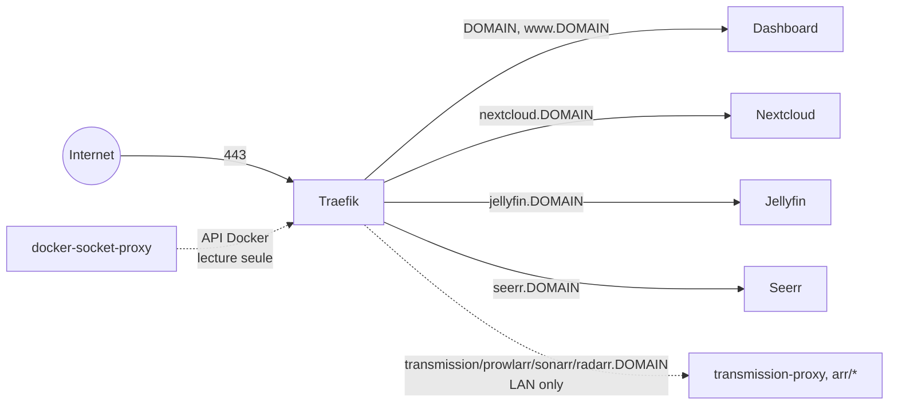
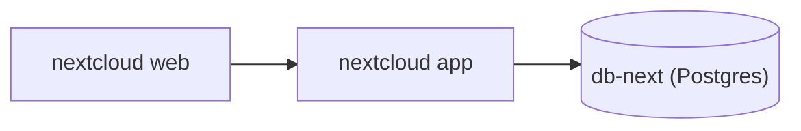
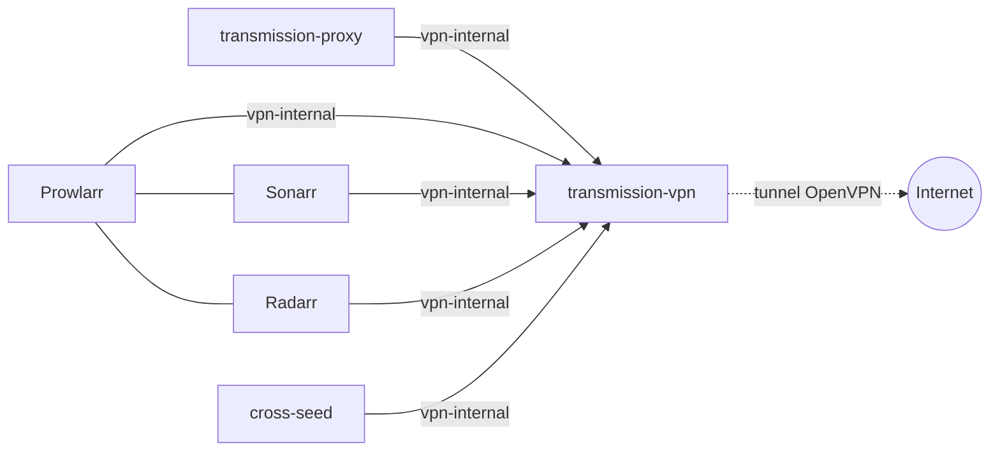
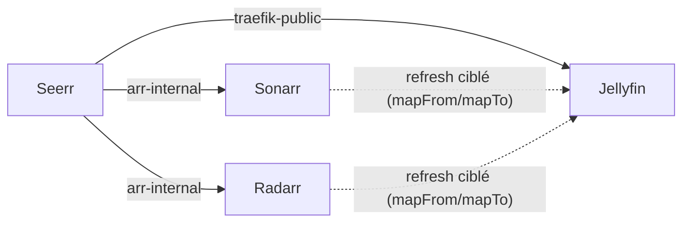

# Architecture

Ce document explique le rôle de chaque service, comment ils communiquent,
et les choix structurants derrière ce repo. Pour l'installation, voir
[`README.md`](README.md) ; pour les problèmes déjà rencontrés en cours de
route, voir [`ISSUES.md`](ISSUES.md).

Principe général : un seul point d'entrée HTTPS (Traefik, port 443) pour
tous les services, un sous-domaine par service. Traefik découvre les
containers via labels Docker, mais ne parle jamais au socket Docker en
direct : il passe par un `docker-socket-proxy` en lecture seule.

## Vue d'ensemble

Le schéma complet (tous les services, tous les réseaux) devenait illisible
en un seul diagramme : il est décomposé ci-dessous par sous-système.

### Point d'entrée

Traefik est l'unique service qui écoute sur 80/443. Tout le reste n'est
joignable que via lui (ou en direct depuis le LAN pour les services
LAN-only).

### Nextcloud

### Téléchargement & VPN

`transmission-vpn` n'est joignable que via ce réseau `vpn-internal`
dédié — jamais directement depuis Traefik (voir
[Arr](#arr-arr) et [VPN / Transmission](#vpn--transmission-vpn) plus bas
pour pourquoi).

### Découverte & lecture

## Services

### Traefik (`traefik/`)

Reverse proxy + TLS. Trois containers :
- `socket-proxy` (`tecnativa/docker-socket-proxy`) : expose une API Docker
  restreinte (containers/networks/services/tasks, lecture seule) sur un
  réseau interne dédié — Traefik ne voit jamais `/var/run/docker.sock`.
- `traefik` : écoute 80/443 sur l'hôte (mappés vers 8080/8443 en interne,
  car le process tourne en non-root et ne peut pas biner les ports < 1024
  directement), obtient les certificats Let's Encrypt via HTTP challenge.
- `dashboard` : sert la page statique de liens vers les services (voir
  [Dashboard](#dashboard-dashboard)) — regroupé ici plutôt que dans son
  propre stack, car Traefik ne sait servir aucun fichier statique lui-même
  (pur reverse-proxy, sans provider "fichiers").

Config statique dans `traefik.yml`. L'email de contact ACME est fourni par
variable d'env (`traefik/.env`), jamais en dur dans le YAML.

**HSTS** (`Strict-Transport-Security`) généralisé à tous les services, y
compris LAN-only (Transmission/Prowlarr/Sonarr/Radarr) : middleware `hsts`
défini une seule fois sur le container `traefik` (labels — pas de routeur
associé, juste une déclaration de middleware réutilisable), référencé
depuis chaque stack via `hsts@docker` plutôt que redéfini partout.
`includeSubDomains` posé sur chaque service individuel plutôt que sur le
seul domaine nu (dashboard) : sinon un visiteur qui ne charge jamais
`<DOMAIN>` directement (favori pointant sur `jellyfin.<DOMAIN>` par ex.)
ne recevrait jamais la directive et resterait sans protection downgrade
sur ce sous-domaine.

Même principe pour **`security-headers`** (généralisé depuis le dashboard
qui l'utilisait seul à l'origine) : `X-Robots-Tag: noindex, nofollow,
noarchive` (serveur perso, aucun service ne doit être indexé par un moteur
de recherche ou appris par un crawler d'entraînement IA), `X-Frame-Options:
DENY`, `X-Content-Type-Options: nosniff`, `Referrer-Policy: no-referrer` —
durcissement standard sans lien avec l'indexation. Middleware défini une
fois sur le container `traefik`, référencé partout via
`security-headers@docker`.

**`rate-limit`** appliqué à `jellyfin` et `seerr` seulement (Nextcloud a
son propre anti-bruteforce intégré, les services `arr`/`transmission` sont
déjà LAN-only via `ipallowlist`) : `average=50`, `burst=100` par IP source.
Limite tout le routeur, pas que l'endpoint de login (Traefik seul ne sait
pas cibler par code de réponse/chemin pour faire du vrai anti-bruteforce à
la fail2ban) — valeurs volontairement généreuses pour ne jamais gêner un
usage normal (Jellyfin charge plusieurs images de bibliothèque en
parallèle).

### Jellyfin (`jellyfin/`)

Media server, accès GPU pour le transcodage (`/dev/dri/renderD128` +
`group_add` sur le GID du groupe `render`). Cache et config sous
`${DATA_ROOT}/.jellyfin/`. Les bibliothèques personnelles (musique, photos,
dossier de téléchargements complétés...) ne sont **pas** dans le compose
file de base : elles vont dans `jellyfin/docker-compose.override.yml`, pour
ne pas coupler ce fichier aux dossiers d'une machine en particulier.
`${DATA_ROOT}/library` (bibliothèque organisée par Sonarr/Radarr, voir
[Arr](#arr-arr)) est monté en lecture seule dans le compose file de base à
`/library` — chemin déjà générique à ce repo, pas un choix propre à une
machine.

Seerr dépend d'une bibliothèque Jellyfin pointant sur ces chemins pour
savoir ce qui est déjà téléchargé (voir [Seerr](#seerr-seerr)).

### Nextcloud (`nextcloud/`)

Image communautaire classique (pas Nextcloud AIO — AIO pilote ses propres
containers via le socket Docker et vit dans sa propre UI, incompatible
avec l'esprit infra-as-code et le modèle rootless de ce repo). Quatre
services :
- `db-next` : Postgres, données sous `${DATA_ROOT}/.nextcloud/db-next`.
- `app` : `nextcloud:fpm-alpine` + `ffmpeg` (prévisualisations vidéo),
  build local (`app/Dockerfile`). Données/config/apps sous
  `${DATA_ROOT}/.nextcloud/nexcloud`. Les montages "external storage"
  (dossiers supplémentaires à exposer dans Nextcloud) vont eux aussi dans
  un `docker-compose.override.yml`, pas dans le fichier de base.
- `web` : `nginxinc/nginx-unprivileged` + config PHP-FPM, écoute sur 8080.
- `news-updater` : rafraîchit périodiquement l'app News de Nextcloud.

### VPN / Transmission (`vpn/`)

Client torrent qui ne doit jamais sortir hors tunnel VPN. Deux services :
- `transmission-vpn` (`haugene/transmission-openvpn`) : sur un réseau
  Docker dédié et **isolé** (`vpn-internal`, subnet pinné) — ne doit
  jamais rejoindre un second réseau ni recevoir son propre sous-réseau
  dans `LOCAL_NETWORK` (voir [`ISSUES.md`](ISSUES.md#vpn--transmission)
  pour pourquoi).
- `transmission-proxy` (nginx) : sidecar sur `vpn-internal` **et**
  `traefik-public`, seul pont entre le VPN et le reste du monde — proxy_pass
  vers le RPC de Transmission. C'est lui qui porte les labels Traefik.

Accès restreint au LAN (`LAN_CIDR` dans `.env.shared`, middleware Traefik
`ipallowlist`) : le client torrent doit pointer vers
`https://transmission.<DOMAIN>/transmission/rpc`, pas `localhost:9091`
(plus de port publié sur l'hôte).

### Arr (`arr/`)

Automatisation de récupération séries/films : cinq services.
- `prowlarr`, `sonarr`, `radarr` (`lscr.io/linuxserver/*`) : gestion des
  indexeurs et suivi des séries/films (saisons/films manquants, import
  automatique). UI restreinte au LAN (même middleware `ipallowlist` que
  Transmission). Ces images démarrent normalement en root (s6-overlay) pour
  appliquer PUID/PGID puis descendre en privilège ; ici elles tournent en
  mode rootless alternatif documenté par LinuxServer (`user: PUID:PGID` +
  `tmpfs /run`, sans `cap_add`) — perd juste le support des Docker
  Mods/Custom Services de ces images (non utilisés).
- `cross-seed` : cross-seed automatique entre trackers différents à partir
  des mêmes indexeurs Prowlarr. Lit en lecture seule les fichiers déjà
  téléchargés par Transmission (mêmes chemins internes que
  `transmission-vpn`, pour que la comparaison de hash fonctionne sans
  remapping) et crée ses propres hardlinks dans un volume séparé en écriture
  (pas sous le même montage `:ro`). Déclenché sur import/upgrade via un
  Custom Script Sonarr/Radarr (`arr/scripts/cross-seed-notify.sh`) — voir
  [`ISSUES.md`](ISSUES.md#arr--sonarr--radarr--cross-seed) pour pourquoi
  pas le type "Webhook" générique.
- `recyclarr` : synchronise dans Sonarr/Radarr des profils qualité/custom
  formats tout faits (TRaSH-Guides) au lieu de les construire à la main —
  tourne en continu avec son propre cron interne (`@daily` par défaut).

`prowlarr`/`sonarr`/`radarr`/`cross-seed` rejoignent aussi `vpn-internal`
(réseau externe créé par la stack `vpn/`) pour atteindre
`transmission-vpn:9091` directement par nom de container — pas via
`transmission-proxy`, qui n'existe que pour l'accès humain LAN-only.
Prowlarr en a besoin pour sa propre section Download Clients (recherche
interactive manuelle, indépendante de Sonarr/Radarr). Rejoindre ce réseau
depuis un autre container ne pose aucun problème : la règle "jamais un
second réseau" ne concerne que `transmission-vpn` lui-même.

`prowlarr`/`sonarr`/`radarr`/`cross-seed` forcent aussi la résolution DNS
sur Cloudflare (`DNS_PRIMARY`/`DNS_SECONDARY` dans `.env.shared`,
`1.1.1.1`/`1.0.0.1` par défaut, même fix que Jellyfin) — voir
[`ISSUES.md`](ISSUES.md) pour le problème que ça contourne.

**Bibliothèque** : Sonarr/Radarr importent (hardlink) vers
`${DATA_ROOT}/library/{series,movies}` (monté en base à `/library`), une
bibliothèque organisée **séparée** du dossier de téléchargement brut
(`${DATA_ROOT}/.transmission/data`, monté à `/data`) — les deux vivent
sous un unique mount `${DATA_ROOT}:/data_root` (nécessaire pour que le
hardlink fonctionne entre les deux, voir [`ISSUES.md`](ISSUES.md)), avec
remote path mapping côté client de téléchargement.

**Rafraîchissement ciblé de Jellyfin** : connexion **Emby/Jellyfin**
(`implementation: MediaBrowser`) sur import/upgrade/renommage et sur
suppression d'un titre ou d'un fichier, ciblant
`jellyfin:8096` en direct (Sonarr/Radarr et Jellyfin partagent déjà le
réseau `traefik-public`, pas besoin de passer par Traefik). Sans elle,
Jellyfin comptait uniquement sur sa surveillance temps réel (inotify,
`EnableRealtimeMonitor`) pour détecter les nouveaux fichiers — qui
fonctionne, mais sans le mapping de chemin un refresh déclenché par
Sonarr/Radarr serait incapable de cibler le bon dossier : Sonarr/Radarr
voient la bibliothèque sous `/data_root/library/...` (montage unique
ci-dessus) alors que Jellyfin la voit sous `/library/...` d'où
`mapFrom=/data_root/library` / `mapTo=/library` dans les deux connexions.
Clé API Jellyfin réutilisée depuis celle déjà générée pour Seerr plutôt
qu'une clé dédiée — apparaît donc sous le nom "Seerr" dans Jellyfin →
Tableau de bord → Clés API, purement cosmétique.

Les déclencheurs de **suppression** de cette connexion comptent autant que
ceux d'import : sans eux, Jellyfin ne découvre la disparition d'un titre que
par sa surveillance temps réel (`LibraryMonitorDelay`, 60 s ici), et un
client qui réplique la bibliothèque Jellyfin plutôt que le disque — Kodi via
jellyfin-kodi, cf. [`kodi/README.md`](kodi/README.md) — continue de l'afficher
d'autant.

Ces deux connexions sont **entièrement provisionnées par
`scripts/apply-arr-overrides.py`** (`make arr-overrides`), création incluse :
nom, cible réseau, mapping de chemins et déclencheurs sont déclarés dans le
script, la seule valeur en `.env` étant `JELLYFIN_API_KEY` (`arr/.env`) parce
qu'elle est secrète. Les autres valeurs ne sont pas propres au déploiement —
`jellyfin:8096` est un nom de service Docker et le mapping découle des montages
du repo — donc rien ne justifiait de les sortir du code. La déclaration fait
autorité : un déclencheur ajouté à la main dans l'UI est remis à `False` au
passage suivant. Seule limite, la clé API elle-même n'est jamais relue (l'API
Servarr la renvoie masquée en `********`) : une clé devenue invalide n'est donc
pas détectée automatiquement, `POST /api/v3/notification/testall` est le moyen
de la vérifier.

Configuration manuelle des UI (indexeurs, connexions, clés API, root
folders...) : voir les étapes d'installation dans
[`README.md`](README.md#12-démarrer-et-configurer-arr-nécessite-vpn-déjà-démarré-la-stack-rejoint-son-réseau-vpn-internal).

### Seerr (`seerr/`)

Interface de recherche/demande unifiée pour les utilisateurs non-techniques :
recherche un film/série (poster, synopsis), un bouton "Demander", et Seerr
pilote Sonarr/Radarr en coulisses — plus besoin d'ouvrir leurs UI. Ancien
Jellyseerr/Overseerr, les deux projets ont fusionné dans `ghcr.io/seerr-team/
seerr` (dépréciés depuis, voir [docs.seerr.dev](https://docs.seerr.dev)).

Contrairement aux images `arr/` (linuxserver.io), celle-ci tourne nativement
en non-root (utilisateur `node`, UID 1000) : pas de `tmpfs /run` ni de
`cap_add` nécessaire, juste `user: ${PUID}:${PGID}` classique — mais elle
ne chown pas non plus son volume elle-même (voir l'étape de bootstrap dans
[`README.md`](README.md)).

Rejoint `arr-internal` (alias vers `arr_default`, le réseau de la stack
`arr/`) pour atteindre `sonarr:8989`/`radarr:7878` directement par nom de
container — ces deux services sont LAN-only sur `traefik-public`
(middleware `ipallowlist`), une requête de Seerr passant par Traefik s'y
ferait donc bloquer. Contrairement à `arr/`, Seerr est exposé sans
restriction LAN (comme Jellyfin) : c'est justement l'interface pensée pour
être utilisée par des non-techniciens, potentiellement hors LAN, avec son
propre mécanisme d'authentification (compte local ou lié à un compte
Jellyfin).

**Détection de disponibilité** : Seerr détermine "déjà disponible" en
scannant les bibliothèques **Jellyfin** (pas en interrogeant Sonarr/Radarr
directement) : sans bibliothèque Jellyfin pointant sur
`${DATA_ROOT}/library` (voir [Jellyfin](#jellyfin-jellyfin)), tout le
contenu déjà téléchargé apparaît comme non disponible et Seerr propose à
tort de le re-demander.

### Dashboard (`dashboard/`)

Page statique listant les services exposés via Traefik, répartis en trois
groupes — **Public** (Jellyfin, Nextcloud, Seerr), **Local/LAN**
(Transmission, Prowlarr, Sonarr, Radarr) et **Stack non lancée** (tout
service dont le container n'est pas actuellement démarré) — avec logo
cliquable qui redirige vers le service. Servie par le container
`dashboard` de la stack `traefik/` (voir [Traefik](#traefik-traefik)),
accessible en WAN comme en LAN sur le domaine nu et `www.<DOMAIN>` (pas de
sous-domaine `dashboard.` dédié, `<DOMAIN>`/`www.<DOMAIN>` libérés par le
passage de Nextcloud sur `nextcloud.<DOMAIN>`), pas de middleware
`ipallowlist` sur son router — les sous-domaines listés sont de toute
façon publics via les logs Certificate Transparency dès qu'un certificat
Let's Encrypt leur a été émis, donc restreindre la page elle-même
n'apportait pas de confidentialité réelle sur leur existence. Pas de
stack dédiée : Traefik ne sachant servir aucun fichier statique lui-même,
ce backend HTTP minimal est rattaché à sa stack plutôt qu'à un
`docker-compose.yml` séparé — `dashboard/` ne contient donc que les assets
et le script de génération, pas de compose file.

Les cartes du groupe **Local/LAN** restent cliquables dans le HTML généré
(elles pointent vers `https://<service>.<DOMAIN>`, qui répond bien 403 côté
Traefik pour un appelant hors `LAN_CIDR`), mais un petit script côté client
les grise dynamiquement pour un visiteur WAN : au chargement, chaque carte
LAN sonde une image réelle du service concerné (``, pas `fetch` — un
`fetch`/`XMLHttpRequest` cross-origin échoue de la même façon (CORS) que la
ressource soit bloquée ou non par l'ipallowlist, il ne permet donc pas de
distinguer les deux cas ; `` s'appuie sur `onload`/`onerror`, qui eux
reflètent le vrai statut HTTP sans dépendre de CORS). `onerror` (403 renvoyé
par l'ipallowlist du service, appelant hors LAN) grise la carte et retire
son lien ; `onload` (LAN) ne change rien. Le chemin sondé par service est
dans `PROBE_PATH` (`scripts/generate-dashboard.py`, `/favicon.ico` par
défaut) — attention, ce chemin doit répondre par une véritable image (pas
une redirection vers du HTML) : `transmission-proxy` redirige
`/favicon.ico` vers `/transmission/web/` (HTML), d'où l'override vers
`/transmission/web/images/favicon.ico` pour ce service.

Étant public, la page est explicitement exclue des moteurs de recherche et
des crawlers d'entraînement IA : balise
`<meta name="robots" content="noindex, nofollow, noarchive">` dans le HTML
généré, `dashboard/assets/robots.txt` (`Disallow: /`, versionné, copié tel
quel par `scripts/generate-dashboard.py`) et en-tête `X-Robots-Tag` posé
par le middleware partagé `security-headers` (voir
[Traefik](#traefik-traefik)) — redondant avec la balise `<meta>` mais
couvre aussi les crawlers qui ne parsent pas le HTML.

Le contenu (`dashboard/html/`, gitignoré) est entièrement généré par
`make dashboard-refresh` (`scripts/generate-dashboard.py`), qui dérive
public/local/arrêté de l'état réel plutôt que d'une liste à maintenir à la
main :

- `docker compose config --format json` sur chaque stack pour lire les
  labels Traefik réels (`Host()` → sous-domaine, présence d'un middleware
  `ipallowlist` sur le router → local vs public) ;
- `docker ps` pour savoir quels services sont actuellement démarrés.

Seule metadata non dérivable des compose files : le nom affiché et le
fichier logo (`dashboard/assets/logos/*.svg`, versionnés) associés à
chaque service — à compléter dans `scripts/generate-dashboard.py` quand un
nouveau service exposé via Traefik apparaît. La regénération n'a pas
besoin que le container tourne ; démarrer/mettre à jour la stack (`make up`
/ `make update STACK=traefik`) sert juste le résultat déjà généré.

Tous les services ont un `healthcheck` Docker (voir plus bas, par stack) et
la génération lit aussi `docker ps --filter health=unhealthy` : un service
qui tourne mais échoue son healthcheck affiche un contour rouge autour de
son logo et un texte d'avertissement sur sa carte. Le dashboard est
régénéré automatiquement toutes les 5 minutes par cron (`scripts/crontab`,
`make cron-install`) pour que ça reste à jour sans dépendre d'un `make
dashboard-refresh` manuel.

### Sauvegarde (`scripts/`)

Politique volontairement simple : **restic**, hebdomadaire (cron dimanche
3h), incrémental/dédupliqué, rétention 8 snapshots (~2 mois), stockée en
local dans `sauvegarde/` (sur un disque différent de `DATA_ROOT`, pour
survivre à la perte de ce dernier). Pas d'offsite/cloud pour l'instant.

Ce qui est sauvegardé : la base Nextcloud (dump `pg_dump` cohérent, pas
une copie brute des fichiers Postgres), le webroot Nextcloud, les configs
Jellyfin/arr (`prowlarr`/`sonarr`/`radarr`/`cross-seed`/`recyclarr`)/Seerr/
Transmission, les `.env` de `traefik`/`nextcloud`/`vpn`/`arr`, `.env.shared`,
et un **manifeste des digests d'images exacts** en cours d'exécution
(toutes les stacks, y compris `arr`/`seerr`) — utile car ce repo reste
volontairement sur des tags `:latest` (voir [Versions des
images](#versions-des-images-latest)), donc une restauration a besoin de
savoir *quelle* image tournait réellement au moment du backup pour être
fidèle. Volontairement **exclu** : `library/` et `.transmission/data/`
(média/téléchargements, ré-obtenables via arr, trop volumineux pour la
valeur de récupération) et `.jellyfin/cache` (purement régénéré).

Résilience visée : perte du disque `DATA_ROOT` → restauration depuis
`sauvegarde/` (sur un disque différent). Perte de celui-ci → seul
l'infra-as-code est récupérable depuis GitHub, la sauvegarde restic est
perdue avec (accepté pour l'instant, pas d'offsite).

Commandes et procédure de restauration : voir
[`README.md`](README.md#maintenance-courante).

## Choix d'architecture

- **Rootless par container** : chaque process applicatif tourne en
  non-root à l'intérieur du container (le daemon Docker, lui, reste
  classique). Tous les services ont `security_opt: no-new-privileges:true`
  et `cap_drop: ALL` ; seuls `db-next` et `transmission-vpn` ont un
  `cap_add` ciblé, documenté en commentaire dans leur compose file — ils
  démarrent en root (pour configurer permissions/réseau) avant de
  descendre en privilège.
- **Secrets et valeurs propres au déploiement** : un `.env` par stack
  (gitignoré) + un `.env.example` versionné à côté pour documenter les
  clés attendues — même chose pour les valeurs partagées entre stacks
  (PUID/PGID, `DOMAIN`, `DATA_ROOT`...) dans `.env.shared`/
  `.env.shared.example` à la racine. `docker compose` ne charge pas ces
  fichiers tout seul (il ne cherche un `.env` que dans le dossier de la
  stack) : passer par le `Makefile` plutôt que par `docker compose` en
  direct.
- **Portabilité des montages hôte** : tout montage qui reflète un choix
  personnel (quelles bibliothèques exposer, sous quel chemin) vit dans un
  `docker-compose.override.yml` gitignoré, templaté par un
  `docker-compose.override.yml.example` versionné — même logique que les
  secrets. Les compose files de base ne gardent que les montages
  génériques (`${DATA_ROOT}/.<app>/...`).
- **Versions des images (`:latest`)** : choix assumé de rester sur les
  dernières versions partout plutôt que de figer des tags, quitte à
  risquer une casse lors d'une mise à jour. La reproductibilité d'une
  restauration passe par le manifeste de digests capturé à chaque backup
  (voir [Sauvegarde](#sauvegarde-scripts)), pas par des tags fixes.
- **Timezone** : chaque service monte `/etc/localtime:/etc/localtime:ro`
  (lecture seule) depuis l'hôte plutôt que de fixer une variable d'env
  `TZ` — ne dépend pas d'un paquet `tzdata` présent dans l'image et suit
  automatiquement les changements d'heure d'été/hiver de l'hôte.
