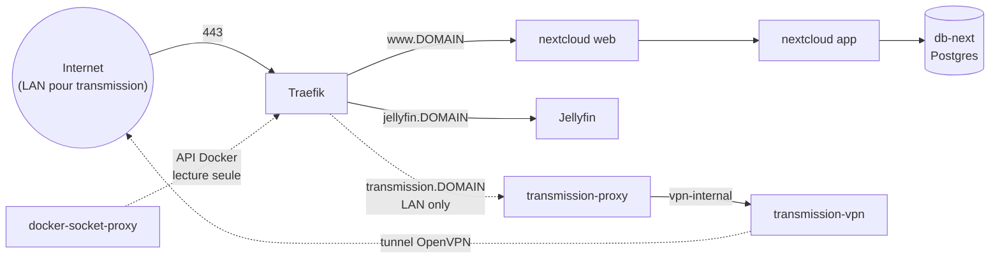

# Serveur maison — infra as code

Docker Compose + Traefik pour faire tourner un petit home server : reverse
proxy HTTPS unique, media server (Jellyfin), cloud personnel (Nextcloud),
client torrent derrière VPN (Transmission), et une politique de sauvegarde
restic. Conçu pour tourner sur une seule machine, mais pensé pour être
repris ailleurs (voir [Installation](#installation)).

> Pour un futur agent/IA qui retravaille sur ce repo : ce README décrit le
> quoi/pourquoi/comment humain. `CLAUDE.md` ne garde que ce qui est utile
> pour intervenir dessus (décisions à respecter, pièges à ne pas répéter).

## Vue d'ensemble



Un seul point d'entrée HTTPS (Traefik, port 443) pour tous les services,
un sous-domaine par service. Traefik découvre les containers via labels
Docker, mais ne parle jamais au socket Docker en direct : il passe par un
`docker-socket-proxy` en lecture seule.

## Services

### Traefik (`traefik/`)

Reverse proxy + TLS. Deux containers :
- `socket-proxy` (`tecnativa/docker-socket-proxy`) : expose une API Docker
  restreinte (containers/networks/services/tasks, lecture seule) sur un
  réseau interne dédié — Traefik ne voit jamais `/var/run/docker.sock`.
- `traefik` : écoute 80/443 sur l'hôte (mappés vers 8080/8443 en interne,
  car le process tourne en non-root et ne peut pas biner les ports < 1024
  directement), obtient les certificats Let's Encrypt via HTTP challenge.

Config statique dans `traefik.yml`. L'email de contact ACME est fourni par
variable d'env (`traefik/.env`, voir plus bas), jamais en dur dans le YAML.

### Jellyfin (`jellyfin/`)

Media server, accès GPU pour le transcodage (`/dev/dri/renderD128` +
`group_add` sur le GID du groupe `render`). Cache et config sous
`${DATA_ROOT}/.jellyfin/`. Les bibliothèques (musique, photos, dossier de
téléchargements complétés...) ne sont **pas** dans le compose file de
base : elles vont dans `jellyfin/docker-compose.override.yml` (voir
[Installation](#installation)), pour ne pas coupler ce fichier aux dossiers
d'une machine en particulier.

### Nextcloud (`nextcloud/`)

Image communautaire classique (pas Nextcloud AIO — AIO pilote ses propres
containers via le socket Docker et vit dans sa propre UI, incompatible
avec l'esprit infra-as-code de ce repo). Quatre services :
- `db-next` : Postgres, données sous `${DATA_ROOT}/.nextcloud/db-next`.
- `app` : `nextcloud:fpm-alpine` + `ffmpeg` (prévisualisations vidéo),
  build local (`app/Dockerfile`). Données/config/apps sous
  `${DATA_ROOT}/.nextcloud/nexcloud`. Les montages "external storage"
  (dossiers supplémentaires à exposer dans Nextcloud) vont eux aussi dans
  un `docker-compose.override.yml`, pas dans le fichier de base.
- `web` : `nginxinc/nginx-unprivileged` + config PHP-FPM, écoute sur 8080.
- `news-updater` : rafraîchit périodiquement l'app News de Nextcloud.

### VPN / Transmission (`vpn/`)

Client torrent qui ne doit jamais sortir hors tunnel VPN. Deux services :
- `transmission-vpn` (`haugene/transmission-openvpn`) : sur un réseau
  Docker dédié et **isolé** (`vpn-internal`, subnet pinné) — voir
  [Pièges rencontrés](#pièges-rencontrés-vpntransmission) pour pourquoi il
  ne doit jamais toucher un second réseau.
- `transmission-proxy` (nginx) : sidecar sur `vpn-internal` **et**
  `traefik-public`, seul pont entre le VPN et le reste du monde — proxy_pass
  vers le RPC de Transmission. C'est lui qui porte les labels Traefik.

Accès restreint au LAN (`192.168.0.0/24` par défaut, middleware Traefik
`ipallowlist`) : le client torrent doit pointer vers
`https://transmission.<DOMAIN>/transmission/rpc`, pas `localhost:9091`
(plus de port publié sur l'hôte).

### Sauvegarde (`scripts/`)

Politique volontairement simple : **restic**, hebdomadaire (cron dimanche
3h), incrémental/dédupliqué, rétention 8 snapshots (~2 mois), stockée en
local dans `sauvegarde/` (sur un disque différent de `DATA_ROOT`, pour
survivre à la perte de ce dernier). Pas d'offsite/cloud pour l'instant.

Ce qui est sauvegardé : la base Nextcloud (dump `pg_dump` cohérent, pas
une copie brute des fichiers Postgres), le webroot Nextcloud, les `.env`
de chaque stack, et un **manifeste des digests d'images exacts** en cours
d'exécution — utile car ce repo reste volontairement sur des tags
`:latest` (voir [Versions des images](#versions-des-images-latest)), donc
une restauration a besoin de savoir *quelle* image tournait réellement au
moment du backup pour être fidèle.

- `make backup` : lance tout le processus (dump, manifeste, `restic
  backup`, `restic forget --keep-weekly 8 --prune`), et tague le commit
  git courant (`backup-YYYY-MM-DD`) si l'infra a changé depuis le dernier
  tag de ce type.
- `make restore SNAPSHOT=<id|latest>` : restaure dans un dossier à part et
  affiche les étapes manuelles pour réintégrer (jamais automatique/live).
- Le mot de passe du dépôt restic est généré au premier `make backup`
  dans `sauvegarde/restic-password` (gitignoré) — **à copier ailleurs**
  (gestionnaire de mots de passe), sans lui le dépôt est illisible.

## Choix d'architecture

- **Rootless par container** : chaque process applicatif tourne en
  non-root à l'intérieur du container (le daemon Docker, lui, reste
  classique). Tous les services ont `security_opt: no-new-privileges:true`
  et `cap_drop: ALL` ; seuls `db-next` et `transmission-vpn` ont un
  `cap_add` ciblé, documenté en commentaire dans leur compose file — ils
  démarrent en root (pour configurer permissions/réseau) avant de
  descendre en privilège.
- **Secrets et valeurs propres au déploiement** : un `.env` par stack
  (gitignoré) + un `.env.example` versionné à côté pour documenter les
  clés attendues — même chose pour les valeurs partagées entre stacks
  (PUID/PGID, `DOMAIN`, `DATA_ROOT`...) dans `.env.shared`/
  `.env.shared.example` à la racine. `docker compose` ne charge pas ces
  fichiers tout seul (il ne cherche un `.env` que dans le dossier de la
  stack) : passer par le `Makefile` plutôt que par `docker compose` en
  direct.
- **Portabilité des montages hôte** : tout montage qui reflète un choix
  personnel (quelles bibliothèques exposer, sous quel chemin) vit dans un
  `docker-compose.override.yml` gitignoré, templaté par un
  `docker-compose.override.yml.example` versionné — même logique que les
  secrets. Les compose files de base ne gardent que les montages
  génériques (`${DATA_ROOT}/.<app>/...`).
- **Versions des images (`:latest`)** : choix assumé de rester sur les
  dernières versions partout plutôt que de figer des tags, quitte à
  risquer une casse lors d'une mise à jour. La reproductibilité d'une
  restauration passe par le manifeste de digests capturé à chaque backup
  (voir [Sauvegarde](#sauvegarde-scripts)), pas par des tags fixes.

## Pièges rencontrés

### VPN/Transmission

- `haugene/transmission-openvpn` pousse une route `redirect-gateway def1`
  qui scinde `0.0.0.0/0` en deux `/1` couvrant la quasi-totalité de
  l'espace IPv4 — y compris `172.16.0.0/12`, la plage que Docker utilise
  par défaut pour ses réseaux. **Attacher ce container à un second réseau
  Docker (ex. le réseau public de Traefik) casse le routing sortant du
  tunnel** (DNS/ping ne sortent plus, `rtnl: generic error (-101)` dans
  les logs) — reproduit de façon fiable, en hot-attach comme en
  déclarant les deux réseaux dès la création. Solution : le garder sur un
  unique réseau dédié (subnet pinné) et faire pont vers Traefik via un
  sidecar (`transmission-proxy`) qui ne touche jamais au tunnel.
- Même piège avec la variable `LOCAL_NETWORK` : elle fait un
  `ip route replace <subnet> via <gw>` par entrée — y mettre le propre
  sous-réseau du container casse pareil le routing. Pour autoriser un pair
  du même réseau Docker (le sidecar) à atteindre le port RPC, utiliser
  `UFW_ALLOW_GW_NET=true` à la place (lecture de route + règle ufw, pas de
  `route replace`).
- Le client torrent doit pointer vers
  `https://transmission.<DOMAIN>/transmission/rpc` : plus de port publié
  sur l'hôte depuis que Transmission est passé derrière le sidecar.

### Traefik / Let's Encrypt

- Traefik **ne retente pas de lui-même** un certificat resté en échec
  (par ex. après un DNS en `NXDOMAIN` au moment de la tentative ACME) :
  une fois le DNS corrigé, il faut redémarrer le container pour relancer
  l'obtention du certificat.

### Divers

- Nextcloud AIO a été volontairement écarté (voir plus haut) : il pilote
  ses propres containers via le socket Docker, ce qui casse à la fois le
  modèle rootless et infra-as-code de ce repo.
- Un ancien plugin Nextcloud (`cms_pico`) laissait une règle de proxy
  hairpin (`location /sites/` → `https://www.<DOMAIN>/`) dans la config
  nginx ; retirée avec le plugin.

## Installation

### Prérequis

- Docker Engine + Docker Compose v2 (`docker compose`, pas
  `docker-compose`), `make`, `git`.
- Un nom de domaine dont vous contrôlez le DNS (pour les sous-domaines et
  les certificats Let's Encrypt), et la capacité de rediriger les ports
  80/443 de votre routeur vers la machine.
- (optionnel, Jellyfin) un GPU exposant `/dev/dri/renderD128` pour le
  transcodage matériel — sinon retirez le bloc `devices`/`group_add` de
  `jellyfin/docker-compose.yml`.
- (optionnel, VPN) un abonnement fournissant une config OpenVPN (`.ovpn`)
  — testé avec un provider custom (AirVPN).
- [`restic`](https://restic.net/) pour les sauvegardes.

### Étapes

1. **Cloner le repo**
   ```sh
   git clone <url-du-repo> server && cd server
   ```

2. **Créer et adapter les valeurs partagées** — copier l'exemple et le
   remplir :
   ```sh
   cp .env.shared.example .env.shared
   ```
   `PUID`/`PGID` (uid/gid de l'utilisateur qui doit posséder les fichiers
   créés), `RENDER_GID` (`getent group render` si vous avez un GPU),
   `DOMAIN` (le vôtre), `DATA_ROOT` (où stocker les données applicatives —
   idéalement un disque avec de la place).

3. **Créer le réseau Docker partagé**
   ```sh
   make network
   ```

4. **Configurer les secrets de chaque stack** — copier l'exemple et
   remplir :
   ```sh
   cp traefik/.env.example    traefik/.env      # ACME_EMAIL
   cp nextcloud/.env.example  nextcloud/.env    # POSTGRES_USER/PASSWORD, NEXTCLOUD_ADMIN_USER/PASSWORD
   cp vpn/.env.example        vpn/.env          # OPENVPN_USERNAME/PASSWORD
   ```

5. **Config OpenVPN** (si vous utilisez la stack `vpn/`) : déposez le
   fichier `.ovpn` fourni par votre provider dans `vpn/custom/` (voir la
   doc de [haugene/docker-transmission-openvpn](https://haugene.github.io/docker-transmission-openvpn/)
   pour `OPENVPN_PROVIDER=CUSTOM`). Adaptez aussi le CIDR LAN en dur dans
   les labels Traefik de `vpn/docker-compose.yml`
   (`ipallowlist.sourcerange=192.168.0.0/24`) à votre propre réseau local.

6. **Montages personnels** (Jellyfin, Nextcloud) — copier les exemples et
   pointer vers vos propres dossiers :
   ```sh
   cp jellyfin/docker-compose.override.yml.example  jellyfin/docker-compose.override.yml
   cp nextcloud/docker-compose.override.yml.example nextcloud/docker-compose.override.yml
   ```

7. **DNS** : créez un enregistrement (A ou AAAA) pour chaque sous-domaine
   utilisé vers l'IP publique de la machine — au minimum
   `www.<DOMAIN>` et `jellyfin.<DOMAIN>`, plus `transmission.<DOMAIN>` si
   vous déployez la stack VPN.

8. **Démarrer Traefik en premier**
   ```sh
   make up STACK=traefik
   make logs STACK=traefik   # vérifier l'obtention des certificats
   ```

9. **Démarrer les autres stacks**
   ```sh
   make up STACK=jellyfin
   make up STACK=nextcloud
   make up STACK=vpn
   ```

10. **Vérifier** : `https://www.<DOMAIN>` (Nextcloud, le compte admin est
    créé automatiquement depuis `NEXTCLOUD_ADMIN_USER`/`PASSWORD`),
    `https://jellyfin.<DOMAIN>`, et `https://transmission.<DOMAIN>`
    depuis le LAN.

11. **Sauvegardes** :
    ```sh
    make backup          # première exécution : crée le dépôt restic et
                          # génère sauvegarde/restic-password — copiez-le
                          # ailleurs immédiatement (gestionnaire de mdp)
    make cron-install     # programme la sauvegarde hebdo + le cron Nextcloud
    ```

### Maintenance courante

| Commande | Effet |
|---|---|
| `make up STACK=<nom>` | démarre/recrée une stack |
| `make down STACK=<nom>` | arrête une stack |
| `make config STACK=<nom>` | affiche la config résolue (debug des `${VAR}`) |
| `make logs STACK=<nom>` | logs en direct |
| `make update STACK=<nom>` | pull + rebuild + recrée (+ maintenance `occ` si `nextcloud`) |
| `make update-all` | `update` sur nextcloud, vpn, jellyfin |
| `make backup` | sauvegarde restic (aussi via cron) |
| `make restore SNAPSHOT=<id\|latest>` | restauration guidée d'un snapshot |
| `make cron-install` | (ré)installe `scripts/crontab` comme crontab de l'hôte |
