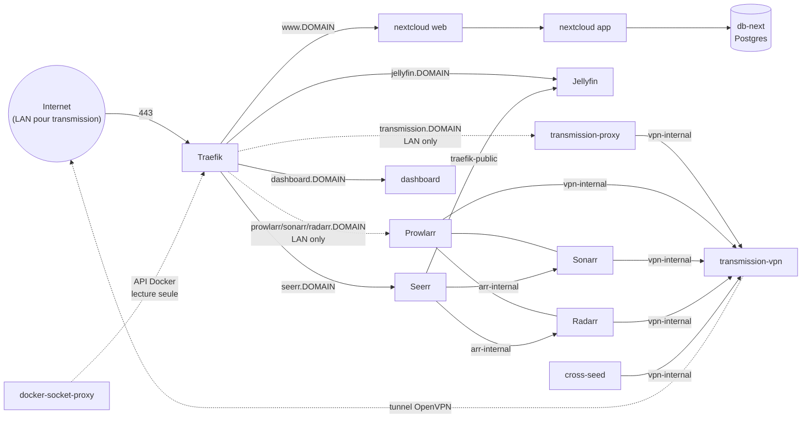

# Serveur maison — infra as code

Docker Compose + Traefik pour faire tourner un petit home server : reverse
proxy HTTPS unique, media server (Jellyfin), cloud personnel (Nextcloud),
client torrent derrière VPN (Transmission), et une politique de sauvegarde
restic. Conçu pour tourner sur une seule machine, mais pensé pour être
repris ailleurs (voir [Installation](#installation)).

> Pour un futur agent/IA qui retravaille sur ce repo : ce README décrit le
> quoi/pourquoi/comment humain. `CLAUDE.md` ne garde que ce qui est utile
> pour intervenir dessus (décisions à respecter, pièges à ne pas répéter).

## Vue d'ensemble



Un seul point d'entrée HTTPS (Traefik, port 443) pour tous les services,
un sous-domaine par service. Traefik découvre les containers via labels
Docker, mais ne parle jamais au socket Docker en direct : il passe par un
`docker-socket-proxy` en lecture seule.

## Services

### Traefik (`traefik/`)

Reverse proxy + TLS. Trois containers :
- `socket-proxy` (`tecnativa/docker-socket-proxy`) : expose une API Docker
  restreinte (containers/networks/services/tasks, lecture seule) sur un
  réseau interne dédié — Traefik ne voit jamais `/var/run/docker.sock`.
- `traefik` : écoute 80/443 sur l'hôte (mappés vers 8080/8443 en interne,
  car le process tourne en non-root et ne peut pas biner les ports < 1024
  directement), obtient les certificats Let's Encrypt via HTTP challenge.
- `dashboard` : sert la page statique de liens vers les services (voir
  [Dashboard](#dashboard-dashboard)) — un backend HTTP minimal, regroupé
  ici plutôt que dans son propre stack, car Traefik ne sait servir aucun
  fichier statique lui-même (pur reverse-proxy, sans provider "fichiers").

Config statique dans `traefik.yml`. L'email de contact ACME est fourni par
variable d'env (`traefik/.env`, voir plus bas), jamais en dur dans le YAML.

### Jellyfin (`jellyfin/`)

Media server, accès GPU pour le transcodage (`/dev/dri/renderD128` +
`group_add` sur le GID du groupe `render`). Cache et config sous
`${DATA_ROOT}/.jellyfin/`. Les bibliothèques personnelles (musique, photos,
dossier de téléchargements complétés...) ne sont **pas** dans le compose
file de base : elles vont dans `jellyfin/docker-compose.override.yml` (voir
[Installation](#installation)), pour ne pas coupler ce fichier aux dossiers
d'une machine en particulier. `${DATA_ROOT}/library` (bibliothèque organisée
par Sonarr/Radarr, voir [Arr](#arr-arr)) est monté en lecture seule dans le
compose file de base à `/library` — chemin déjà générique à ce repo, pas un
choix propre à une machine. Ajoutez ensuite deux bibliothèques dans l'UI
Jellyfin (type Films → `/library/film`, type Séries → `/library/series`) :
sans ça, [Seerr](#seerr-seerr) ne peut pas savoir qu'un film/une série est
déjà téléchargé et le propose à tort en requête.

### Nextcloud (`nextcloud/`)

Image communautaire classique (pas Nextcloud AIO — AIO pilote ses propres
containers via le socket Docker et vit dans sa propre UI, incompatible
avec l'esprit infra-as-code de ce repo). Quatre services :
- `db-next` : Postgres, données sous `${DATA_ROOT}/.nextcloud/db-next`.
- `app` : `nextcloud:fpm-alpine` + `ffmpeg` (prévisualisations vidéo),
  build local (`app/Dockerfile`). Données/config/apps sous
  `${DATA_ROOT}/.nextcloud/nexcloud`. Les montages "external storage"
  (dossiers supplémentaires à exposer dans Nextcloud) vont eux aussi dans
  un `docker-compose.override.yml`, pas dans le fichier de base.
- `web` : `nginxinc/nginx-unprivileged` + config PHP-FPM, écoute sur 8080.
- `news-updater` : rafraîchit périodiquement l'app News de Nextcloud.

### VPN / Transmission (`vpn/`)

Client torrent qui ne doit jamais sortir hors tunnel VPN. Deux services :
- `transmission-vpn` (`haugene/transmission-openvpn`) : sur un réseau
  Docker dédié et **isolé** (`vpn-internal`, subnet pinné) — voir
  [Pièges rencontrés](#pièges-rencontrés-vpntransmission) pour pourquoi il
  ne doit jamais toucher un second réseau.
- `transmission-proxy` (nginx) : sidecar sur `vpn-internal` **et**
  `traefik-public`, seul pont entre le VPN et le reste du monde — proxy_pass
  vers le RPC de Transmission. C'est lui qui porte les labels Traefik.

Accès restreint au LAN (`LAN_CIDR` dans `.env.shared`, middleware Traefik
`ipallowlist`) : le client torrent doit pointer vers
`https://transmission.<DOMAIN>/transmission/rpc`, pas `localhost:9091`
(plus de port publié sur l'hôte).

### Arr (`arr/`)

Automatisation de récupération séries/films : cinq services.
- `prowlarr`, `sonarr`, `radarr` (`lscr.io/linuxserver/*`) : gestion des
  indexeurs et suivi des séries/films (saisons/films manquants, import
  automatique). UI restreinte au LAN (même middleware `ipallowlist` que
  Transmission). Ces images démarrent normalement en root (s6-overlay) pour
  appliquer PUID/PGID puis descendre en privilège ; ici elles tournent en
  mode rootless alternatif documenté par LinuxServer (`user: PUID:PGID` +
  `tmpfs /run`, sans `cap_add`) — perd juste le support des Docker
  Mods/Custom Services de ces images (non utilisés).
- `cross-seed` : cross-seed automatique entre trackers différents à partir
  des mêmes indexeurs Prowlarr. Lit en lecture seule les fichiers déjà
  téléchargés par Transmission (mêmes chemins internes que
  `transmission-vpn`, pour que la comparaison de hash fonctionne sans
  remapping) et crée ses propres hardlinks dans un volume séparé en écriture
  (pas sous le même montage `:ro`, voir commentaire dans le compose file).
  Déclenché sur import/upgrade via un **Custom Script** Sonarr/Radarr
  (`arr/scripts/cross-seed-notify.sh`), pas le type "Webhook" générique de
  Sonarr — celui-ci envoie un payload de test factice (pas de vrai hash de
  torrent) que cross-seed rejette, ce qui bloque l'enregistrement de la
  connexion côté Sonarr/Radarr.
  `useClientTorrents` (faux par défaut chez cross-seed) doit être à `true`
  dans `arr/cross-seed/config.js` : sans ça, le webhook déclenché par ce
  script ne consulte jamais le client réel pour matcher le hash reçu et
  échoue systématiquement (`Torrent client does not have any torrent with
  criteria`), même quand le torrent y est bien présent — vérifié en
  interrogeant directement l'API RPC de `transmission-vpn`.
- `recyclarr` : synchronise dans Sonarr/Radarr des profils qualité/custom
  formats tout faits (TRaSH-Guides) au lieu de les construire à la main —
  tourne en continu avec son propre cron interne (`@daily` par défaut).

`prowlarr`/`sonarr`/`radarr`/`cross-seed` rejoignent aussi `vpn-internal`
(réseau externe créé par la stack `vpn/`) pour atteindre
`transmission-vpn:9091` directement par nom de container — pas via
`transmission-proxy`, qui n'existe que pour l'accès humain LAN-only.
Prowlarr en a besoin pour sa propre section Download Clients (recherche
interactive manuelle, indépendante de Sonarr/Radarr). Rejoindre ce réseau
depuis un autre container ne pose aucun problème : la règle "jamais un
second réseau" ne concerne que `transmission-vpn` lui-même (voir
[Pièges rencontrés](#vpntransmission)).

`prowlarr`/`sonarr`/`radarr`/`cross-seed` forcent aussi la résolution DNS
sur Cloudflare (`DNS_PRIMARY`/`DNS_SECONDARY` dans `.env.shared`,
`1.1.1.1`/`1.0.0.1` par défaut, même fix que Jellyfin) : le résolveur
du FAI peut renvoyer `127.0.0.1` pour certains domaines de trackers/indexeurs
(blocage anti-piratage côté FAI), ce qui ressemble à une panne réseau
("Connection refused") alors que le domaine répond normalement via un DNS
public.

Bibliothèque : Sonarr/Radarr importent (hardlink) vers
`${DATA_ROOT}/library/{series,movies}` (monté en base à `/library`), une
bibliothèque organisée **séparée** du dossier de téléchargement brut
(`${DATA_ROOT}/.transmission/data`, monté à `/data`). Nécessaire car le
scan d'import automatique de Sonarr/Radarr ("dossiers non mappés") ignore
silencieusement les fichiers vidéo posés directement à la racine d'un
dossier scanné — il ne reconnaît que la convention un-film/une-série par
dossier. Pour importer un fichier existant qui n'est pas déjà dans son
propre sous-dossier (le cas classique d'un dossier de téléchargements géré
manuellement jusqu'ici), utiliser **Manual Import** (pas le scan
automatique), qui liste aussi les fichiers en vrac et permet de les
associer film par film avec le mode Hardlink.

Bootstrap après le premier `make up STACK=arr` (les clés API sont générées
au premier démarrage de chaque app, impossible de les connaître avant) :
1. Récupérer `<ApiKey>` dans
   `${DATA_ROOT}/.arr/{prowlarr,sonarr,radarr}/config/config.xml` (ou
   Settings → General dans chaque UI), les reporter dans `arr/.env`.
   Récupérer aussi la clé cross-seed (`docker compose ... exec cross-seed
   cross-seed api-key`) pour `CROSSSEED_API_KEY`, utilisée par
   `arr/scripts/cross-seed-notify.sh`.
2. `make up STACK=arr` à nouveau pour que `cross-seed`/`recyclarr`
   redémarrent avec les vraies clés.
3. Configuration manuelle via les UI (normal pour cet écosystème, pas
   automatisable en compose) : ajouter des indexeurs dans Prowlarr, le
   connecter à Sonarr/Radarr (Settings → Apps), configurer Transmission
   comme client de téléchargement dans Sonarr/Radarr (host
   `transmission-vpn`, port `9091`), ajouter `/library/series` et
   `/library/movies` comme Root Folders, et ajouter le script
   `/config/custom-cross-seed-notify.sh` comme Connection "Custom Script"
   (déclenché sur Import/Upgrade).

Si votre bibliothèque (`${DATA_ROOT}/library`) n'est pas sur le même disque
que le reste de `DATA_ROOT` (vérifiable avec `df` sur les deux chemins),
les imports Sonarr/Radarr basculeront automatiquement en copie au lieu du
hardlink — fonctionnel mais plus lent et transitoirement plus gourmand en
espace disque.

### Seerr (`seerr/`)

Interface de recherche/demande unifiée pour les utilisateurs non-techniques :
recherche un film/série (poster, synopsis), un bouton "Demander", et Seerr
pilote Sonarr/Radarr en coulisses — plus besoin d'ouvrir leurs UI. Ancien
Jellyseerr/Overseerr, les deux projets ont fusionné dans `ghcr.io/seerr-team/
seerr` (dépréciés depuis, voir [docs.seerr.dev](https://docs.seerr.dev)) ; à
ne pas rechercher séparément dans un futur avatar de ce repo.

Contrairement aux images `arr/` (linuxserver.io), celle-ci tourne nativement
en non-root (utilisateur `node`, UID 1000) : pas de `tmpfs /run` ni de
`cap_add` nécessaire, juste `user: ${PUID}:${PGID}` classique — mais elle ne
chown pas non plus son volume elle-même. Si `${DATA_ROOT}/.seerr/config`
n'existe pas encore, Docker le crée en `root:root` et le container crash en
boucle (`EACCES` sur `/app/config/logs`) : `sudo chown -R 1000:1000
${DATA_ROOT}/.seerr` avant le tout premier `make up STACK=seerr`.

Rejoint `arr-internal` (alias vers `arr_default`, le réseau de la stack
`arr/`) pour atteindre `sonarr:8989`/`radarr:7878` directement par nom de
container — ces deux services sont LAN-only sur `traefik-public` (middleware
`ipallowlist`), une requête de Seerr passant par Traefik s'y ferait donc
bloquer. Contrairement à `arr/`, Seerr est exposé sans restriction LAN
(comme Jellyfin) : c'est justement l'interface pensée pour être utilisée
par des non-techniciens, potentiellement hors LAN, avec son propre
mécanisme d'authentification (compte local ou lié à un compte Jellyfin).

Bootstrap après le premier `make up STACK=seerr` : tout se configure ensuite
via l'assistant de première connexion (`https://seerr.<DOMAIN>`) — connexion
à Jellyfin (`http://jellyfin:8096`) puis à Sonarr/Radarr
(`http://sonarr:8989`/`http://radarr:7878`, clés API dans `arr/.env`), rien
à préremplir côté fichiers de config. Nécessite donc `jellyfin` et `arr`
déjà démarrés.

Seerr détermine "déjà disponible" en scannant les bibliothèques **Jellyfin**
(pas en interrogeant Sonarr/Radarr directement) : sans bibliothèque Jellyfin
pointant sur `${DATA_ROOT}/library` (voir [Jellyfin](#jellyfin-jellyfin)),
tout le contenu déjà téléchargé apparaît comme non disponible et Seerr
propose à tort de le re-demander. Après avoir ajouté les bibliothèques
Jellyfin, lancer manuellement le job **"Jellyfin Full Library Scan"** côté
Seerr (Settings → Jobs & Cache) plutôt que d'attendre le cron périodique.

### Dashboard (`dashboard/`)

Page statique listant les services exposés via Traefik, répartis en trois
groupes — **Public** (Jellyfin, Nextcloud, Seerr), **Local/LAN**
(Transmission, Prowlarr, Sonarr, Radarr) et **Stack non lancée** (tout
service dont le container n'est pas actuellement démarré) — avec logo
cliquable qui redirige vers le service. Servie par le container
`dashboard` de la stack `traefik/` (voir [Traefik](#traefik-traefik)),
accessible en WAN comme en LAN (`dashboard.<DOMAIN>`, pas de middleware
`ipallowlist` sur son router — évalué le 2026-07-24 : les sous-domaines
listés sont de toute façon publics via les logs Certificate Transparency
dès qu'un certificat Let's Encrypt leur a été émis, donc restreindre la
page elle-même n'apportait pas de confidentialité réelle sur leur
existence). Pas de stack dédiée : Traefik ne sachant servir aucun fichier
statique lui-même, ce backend HTTP minimal est rattaché à sa stack plutôt
qu'à un `docker-compose.yml` séparé — `dashboard/` ne contient donc que
les assets et le script de génération, pas de compose file.

Les cartes du groupe **Local/LAN** restent cliquables dans le HTML généré
(elles pointent vers `https://<service>.<DOMAIN>`, qui répond bien 403 côté
Traefik pour un appelant hors `LAN_CIDR`), mais un petit script côté client
les grise dynamiquement pour un visiteur WAN : au chargement, chaque carte
LAN sonde une image réelle du service concerné (``, pas `fetch` — un
`fetch`/`XMLHttpRequest` cross-origin échoue de la même façon (CORS) que la
ressource soit bloquée ou non par l'ipallowlist, il ne permet donc pas de
distinguer les deux cas ; `` s'appuie sur `onload`/`onerror`, qui eux
reflètent le vrai statut HTTP sans dépendre de CORS). `onerror` (403 renvoyé
par l'ipallowlist du service, appelant hors LAN) grise la carte et retire
son lien ; `onload` (LAN) ne change rien. Le chemin sondé par service est
dans `PROBE_PATH` (`scripts/generate-dashboard.sh`, `/favicon.ico` par
défaut) — attention, ce chemin doit répondre par une véritable image (pas
une redirection vers du HTML) : `transmission-proxy` redirige
`/favicon.ico` vers `/transmission/web/` (HTML), d'où l'override vers
`/transmission/web/images/favicon.ico` pour ce service (vérifié le
2026-07-24 par sonde `curl` avec IP source forcée dans/hors `LAN_CIDR`).

Le contenu (`dashboard/html/`, gitignoré) est entièrement généré par
`make dashboard-refresh` (`scripts/generate-dashboard.sh`), qui dérive
public/local/arrêté de l'état réel plutôt que d'une liste à maintenir à la
main :

- `docker compose config --format json` sur chaque stack pour lire les
  labels Traefik réels (`Host()` → sous-domaine, présence d'un middleware
  `ipallowlist` sur le router → local vs public) ;
- `docker ps` pour savoir quels services sont actuellement démarrés.

Seule metadata non dérivable des compose files : le nom affiché et le
fichier logo (`dashboard/assets/logos/*.svg`, versionnés) associés à
chaque service — à compléter dans `scripts/generate-dashboard.sh` quand un
nouveau service exposé via Traefik apparaît. La regénération n'a pas
besoin que le container tourne ; démarrer/mettre à jour la stack (`make up`
/ `make update STACK=traefik`) sert juste le résultat déjà généré.

### Sauvegarde (`scripts/`)

Politique volontairement simple : **restic**, hebdomadaire (cron dimanche
3h), incrémental/dédupliqué, rétention 8 snapshots (~2 mois), stockée en
local dans `sauvegarde/` (sur un disque différent de `DATA_ROOT`, pour
survivre à la perte de ce dernier). Pas d'offsite/cloud pour l'instant.

Ce qui est sauvegardé : la base Nextcloud (dump `pg_dump` cohérent, pas
une copie brute des fichiers Postgres), le webroot Nextcloud, les configs
Jellyfin/arr (`prowlarr`/`sonarr`/`radarr`/`cross-seed`/`recyclarr`)/Seerr/
Transmission, les `.env` de `traefik`/`nextcloud`/`vpn`/`arr`, `.env.shared`,
et un **manifeste des digests d'images exacts** en cours d'exécution
(toutes les stacks, y compris `arr`/`seerr`) — utile car ce repo reste
volontairement sur des tags `:latest` (voir
[Versions des images](#versions-des-images-latest)), donc une restauration
a besoin de savoir *quelle* image tournait réellement au moment du backup
pour être fidèle. Volontairement **exclu** : `library/` et
`.transmission/data/` (média/téléchargements, ré-obtenables via arr, trop
volumineux pour la valeur de récupération) et `.jellyfin/cache` (purement
régénéré).

- `make backup` : lance tout le processus (dump, manifeste, `restic
  backup`, `restic forget --keep-weekly 8 --prune`), et tague le commit
  git courant (`backup-YYYY-MM-DD`) si l'infra a changé depuis le dernier
  tag de ce type.
- `make restore SNAPSHOT=<id|latest>` : restaure dans un dossier à part et
  affiche les étapes manuelles pour réintégrer (jamais automatique/live).
- Le mot de passe du dépôt restic est généré au premier `make backup`
  dans `sauvegarde/restic-password` (gitignoré) — **à copier ailleurs**
  (gestionnaire de mots de passe), sans lui le dépôt est illisible.

## Choix d'architecture

- **Rootless par container** : chaque process applicatif tourne en
  non-root à l'intérieur du container (le daemon Docker, lui, reste
  classique). Tous les services ont `security_opt: no-new-privileges:true`
  et `cap_drop: ALL` ; seuls `db-next` et `transmission-vpn` ont un
  `cap_add` ciblé, documenté en commentaire dans leur compose file — ils
  démarrent en root (pour configurer permissions/réseau) avant de
  descendre en privilège.
- **Secrets et valeurs propres au déploiement** : un `.env` par stack
  (gitignoré) + un `.env.example` versionné à côté pour documenter les
  clés attendues — même chose pour les valeurs partagées entre stacks
  (PUID/PGID, `DOMAIN`, `DATA_ROOT`...) dans `.env.shared`/
  `.env.shared.example` à la racine. `docker compose` ne charge pas ces
  fichiers tout seul (il ne cherche un `.env` que dans le dossier de la
  stack) : passer par le `Makefile` plutôt que par `docker compose` en
  direct.
- **Portabilité des montages hôte** : tout montage qui reflète un choix
  personnel (quelles bibliothèques exposer, sous quel chemin) vit dans un
  `docker-compose.override.yml` gitignoré, templaté par un
  `docker-compose.override.yml.example` versionné — même logique que les
  secrets. Les compose files de base ne gardent que les montages
  génériques (`${DATA_ROOT}/.<app>/...`).
- **Versions des images (`:latest`)** : choix assumé de rester sur les
  dernières versions partout plutôt que de figer des tags, quitte à
  risquer une casse lors d'une mise à jour. La reproductibilité d'une
  restauration passe par le manifeste de digests capturé à chaque backup
  (voir [Sauvegarde](#sauvegarde-scripts)), pas par des tags fixes.
- **Timezone** : chaque service monte `/etc/localtime:/etc/localtime:ro`
  (lecture seule) depuis l'hôte plutôt que de fixer une variable d'env
  `TZ` — ne dépend pas d'un paquet `tzdata` présent dans l'image et suit
  automatiquement les changements d'heure d'été/hiver de l'hôte. Motif déjà
  en place sur `vpn/transmission-vpn` avant même l'existence de ce repo,
  généralisé aux autres stacks le 2026-07-23.

## Pièges rencontrés

### VPN/Transmission

- `haugene/transmission-openvpn` pousse une route `redirect-gateway def1`
  qui scinde `0.0.0.0/0` en deux `/1` couvrant la quasi-totalité de
  l'espace IPv4 — y compris `172.16.0.0/12`, la plage que Docker utilise
  par défaut pour ses réseaux. **Attacher ce container à un second réseau
  Docker (ex. le réseau public de Traefik) casse le routing sortant du
  tunnel** (DNS/ping ne sortent plus, `rtnl: generic error (-101)` dans
  les logs) — reproduit de façon fiable, en hot-attach comme en
  déclarant les deux réseaux dès la création. Solution : le garder sur un
  unique réseau dédié (subnet pinné) et faire pont vers Traefik via un
  sidecar (`transmission-proxy`) qui ne touche jamais au tunnel.
- Même piège avec la variable `LOCAL_NETWORK` : elle fait un
  `ip route replace <subnet> via <gw>` par entrée — y mettre le propre
  sous-réseau du container casse pareil le routing. Pour autoriser un pair
  du même réseau Docker (le sidecar) à atteindre le port RPC, utiliser
  `UFW_ALLOW_GW_NET=true` à la place (lecture de route + règle ufw, pas de
  `route replace`).
- Le client torrent doit pointer vers
  `https://transmission.<DOMAIN>/transmission/rpc` : plus de port publié
  sur l'hôte depuis que Transmission est passé derrière le sidecar.
- `haugene/transmission-openvpn` a besoin du module kernel `ip_tables` sur
  l'hôte pour ses règles de routing/kill-switch — absent par défaut sur
  les Ubuntu récents (remplacé par `nftables`). Sans lui le container ne
  démarre pas correctement. Fix : `/etc/modules-load.d/ip-tables.conf`
  contenant `ip_tables` pour le charger au boot (voir Prérequis).

### Traefik / Let's Encrypt

- Traefik **ne retente pas de lui-même** un certificat resté en échec
  (par ex. après un DNS en `NXDOMAIN` au moment de la tentative ACME) :
  une fois le DNS corrigé, il faut redémarrer le container pour relancer
  l'obtention du certificat.

### Divers

- Nextcloud AIO a été volontairement écarté (voir plus haut) : il pilote
  ses propres containers via le socket Docker, ce qui casse à la fois le
  modèle rootless et infra-as-code de ce repo.
- Un ancien plugin Nextcloud (`cms_pico`) laissait une règle de proxy
  hairpin (`location /sites/` → `https://www.<DOMAIN>/`) dans la config
  nginx ; retirée avec le plugin.

### Windows / WSL2

Ce repo suppose un vrai hôte Linux (bare metal ou VM Linux) ; **pas testé
ni recommandé sous Windows + WSL2**, pour plusieurs raisons qui touchent
au cœur de l'architecture, pas de simples détails :

- Le noyau WSL2 est un noyau Microsoft figé, sans chargement de module à
  la `modprobe`/`systemd-modules-load` — le fix `ip_tables` (voir
  [Pièges rencontrés — VPN/Transmission](#vpntransmission)) risque de ne
  pas s'appliquer, et sans lui le kill-switch iptables de
  `transmission-vpn` ne fonctionne probablement pas.
- Traefik + Let's Encrypt (HTTP-01) exigent une machine joignable
  directement depuis internet sur 80/443 ; sous WSL2 le trafic doit
  traverser routeur → Windows → VM WSL2 (NAT), ce qui demande des règles
  `netsh portproxy` en plus et une IP de VM qui change à chaque
  redémarrage (sauf mode "mirrored networking", récent et pas garanti
  stable).
- WSL2 n'est pas un service persistant : Windows peut arrêter la VM en
  idle, ce qui casse la sauvegarde cron du dimanche (`make cron-install`)
  et la disponibilité continue des services, sauf configuration
  supplémentaire pour empêcher l'arrêt/forcer le démarrage au boot.
- Les hardlinks dont dépendent l'import Sonarr/Radarr et
  `torrent-cleanup.py` (voir CLAUDE.md, section hardlinks) ne fonctionnent
  que si `DATA_ROOT` est sur le filesystem natif WSL2 (ext4 virtuel) — sur
  un disque Windows monté en `/mnt/c/...` (drvfs), ils cassent et on
  retombe sur des copies complètes.
- Le passthrough GPU de WSL2 cible CUDA/DirectML, pas les render nodes
  VAAPI Intel/AMD (`/dev/dri/renderD128`) — le transcodage matériel
  Jellyfin est probablement inutilisable tel quel.

Le modèle rootless (`cap_drop`/`no-new-privileges`) n'a lui aucun souci
particulier sous WSL2. Les stacks sans réseau public ni VPN (Nextcloud,
Jellyfin sans transcodage matériel) pourraient tourner en bricolant un
peu, mais l'architecture globale ne s'y prête pas.

## Installation

### Prérequis

- Un hôte Linux natif (voir [Windows / WSL2](#windows--wsl2) juste
  au-dessus pour pourquoi).
- Docker Engine + Docker Compose v2 (`docker compose`, pas
  `docker-compose`), `make`, `git`.
- Un nom de domaine dont vous contrôlez le DNS (pour les sous-domaines et
  les certificats Let's Encrypt), et la capacité de rediriger les ports
  80/443 de votre routeur vers la machine.
- (optionnel, Jellyfin) un GPU exposant `/dev/dri/renderD128` pour le
  transcodage matériel — sinon retirez le bloc `devices`/`group_add` de
  `jellyfin/docker-compose.yml`.
- (optionnel, VPN) un abonnement fournissant une config OpenVPN (`.ovpn`)
  — testé avec un provider custom (AirVPN).
- (VPN) module kernel `ip_tables` chargé sur l'hôte — les Ubuntu récents
  ne le chargent plus par défaut, or `haugene/transmission-openvpn` en a
  besoin pour ses règles de routing/kill-switch. Si le container échoue à
  démarrer ou que le tunnel ne route rien, vérifier `lsmod | grep
  ip_tables` et sinon créer `/etc/modules-load.d/ip-tables.conf` contenant
  `ip_tables` (puis `modprobe ip_tables` ou reboot).
- [`restic`](https://restic.net/) pour les sauvegardes.

### Étapes

1. **Cloner le repo**
   ```sh
   git clone <url-du-repo> server && cd server
   ```

2. **Créer et adapter les valeurs partagées** — copier l'exemple et le
   remplir :
   ```sh
   cp .env.shared.example .env.shared
   ```
   `PUID`/`PGID` (uid/gid de l'utilisateur qui doit posséder les fichiers
   créés), `RENDER_GID` (`getent group render` si vous avez un GPU),
   `DOMAIN` (le vôtre), `DATA_ROOT` (où stocker les données applicatives —
   idéalement un disque avec de la place), `LAN_CIDR` (plage de votre
   réseau local — restreint l'accès à Transmission/Arr via le middleware
   Traefik `ipallowlist`, lu par `vpn/` et `arr/`),
   `DNS_PRIMARY`/`DNS_SECONDARY` (résolveurs DNS forcés sur Jellyfin/arr/vpn
   pour contourner un éventuel DNS de FAI menteur — Cloudflare par défaut,
   pas besoin d'y toucher sauf préférence).

3. **Créer le réseau Docker partagé**
   ```sh
   make network
   ```

4. **Configurer les secrets de chaque stack** — copier l'exemple et
   remplir :
   ```sh
   cp traefik/.env.example    traefik/.env      # ACME_EMAIL
   cp nextcloud/.env.example  nextcloud/.env    # POSTGRES_USER/PASSWORD, NEXTCLOUD_ADMIN_USER/PASSWORD
   cp vpn/.env.example        vpn/.env          # OPENVPN_USERNAME/PASSWORD
   cp arr/.env.example        arr/.env          # PROWLARR/SONARR/RADARR/CROSSSEED_API_KEY (à remplir après le 1er démarrage, voir plus haut)
   ```

5. **Config OpenVPN** (si vous utilisez la stack `vpn/`) : déposez le
   fichier `.ovpn` fourni par votre provider dans `vpn/custom/` (voir la
   doc de [haugene/docker-transmission-openvpn](https://haugene.github.io/docker-transmission-openvpn/)
   pour `OPENVPN_PROVIDER=CUSTOM`).

6. **Montages personnels** (Jellyfin, Nextcloud) — copier les exemples et
   pointer vers vos propres dossiers :
   ```sh
   cp jellyfin/docker-compose.override.yml.example  jellyfin/docker-compose.override.yml
   cp nextcloud/docker-compose.override.yml.example nextcloud/docker-compose.override.yml
   ```
   `arr/docker-compose.override.yml` n'est **pas** à copier par défaut —
   Sonarr/Radarr utilisent déjà `${DATA_ROOT}/library` par défaut (voir plus
   haut), l'override ne sert que si vous voulez cette bibliothèque ailleurs.

7. **DNS** : créez un enregistrement (A ou AAAA) pour chaque sous-domaine
   utilisé vers l'IP publique de la machine — au minimum
   `www.<DOMAIN>` et `jellyfin.<DOMAIN>`, plus `transmission.<DOMAIN>` si
   vous déployez la stack VPN, `prowlarr.<DOMAIN>`/`sonarr.<DOMAIN>`/
   `radarr.<DOMAIN>` si vous déployez la stack `arr`, et `seerr.<DOMAIN>`
   si vous déployez `seerr`.

8. **Démarrer Traefik en premier**
   ```sh
   make up STACK=traefik
   make logs STACK=traefik   # vérifier l'obtention des certificats
   ```

9. **Démarrer les autres stacks**
   ```sh
   make up STACK=jellyfin
   make up STACK=nextcloud
   make up STACK=vpn
   make up STACK=arr      # nécessite vpn déjà démarré (rejoint son réseau vpn-internal)
   mkdir -p ${DATA_ROOT}/.seerr/config && sudo chown -R ${PUID}:${PGID} ${DATA_ROOT}/.seerr
   make up STACK=seerr    # nécessite jellyfin et arr déjà démarrés (rejoint arr_default)
   ```

10. **Vérifier** : `https://www.<DOMAIN>` (Nextcloud, le compte admin est
    créé automatiquement depuis `NEXTCLOUD_ADMIN_USER`/`PASSWORD`),
    `https://jellyfin.<DOMAIN>`, `https://transmission.<DOMAIN>` depuis le
    LAN, et `https://seerr.<DOMAIN>` (assistant de première connexion, voir
    [Seerr](#seerr-seerr)).

11. **Sauvegardes** :
    ```sh
    make backup          # première exécution : crée le dépôt restic et
                          # génère sauvegarde/restic-password — copiez-le
                          # ailleurs immédiatement (gestionnaire de mdp)
    make cron-install     # programme la sauvegarde hebdo + le cron Nextcloud
    ```

### Maintenance courante

| Commande | Effet |
|---|---|
| `make up STACK=<nom>` | démarre/recrée une stack |
| `make down STACK=<nom>` | arrête une stack |
| `make config STACK=<nom>` | affiche la config résolue (debug des `${VAR}`) |
| `make logs STACK=<nom>` | logs en direct |
| `make update STACK=<nom>` | pull + rebuild + recrée (+ maintenance `occ` si `nextcloud`) |
| `make update-all` | `update` sur nextcloud, vpn, jellyfin, arr |
| `make backup` | sauvegarde restic (aussi via cron) |
| `make restore SNAPSHOT=<id\|latest>` | restauration guidée d'un snapshot |
| `make cron-install` | (ré)installe `scripts/crontab` comme crontab de l'hôte |
| `make cleanup` | TUI de nettoyage torrents/bibliothèque, voir ci-dessous |

#### Supprimer un torrent + sa place dans la bibliothèque (`make cleanup`)

Sonarr/Radarr et Transmission ne se parlent pas à la suppression : effacer
un film/une série dans Sonarr/Radarr ne touche pas le torrent dans le
client, et inversement. C'est un manque connu et non résolu de
l'écosystème *arr (aucun outil communautaire — Decluttarr, Removarr... —
ne couvre ce cas précis). `scripts/torrent-cleanup.py` comble ce trou pour
ce déploiement précis : un TUI qui liste les torrents Transmission (âge,
taille, ratio, tracker — résolu via Prowlarr quand possible) et, à la
suppression d'un torrent, retrouve et supprime aussi les fichiers
`library/` correspondants (matching par inode — ne fonctionne que parce
que Sonarr/Radarr importent en hardlink, voir plus haut).

Contrôles : `↑`/`↓`/`j`/`k` naviguer, `/` filtrer par nom, `s`/`S` changer
le critère de tri ou son sens, `Entrée` supprimer avec confirmation
(détail des fichiers touchés), `D` (majuscule) supprimer directement sans
confirmation, `q` quitter. Le marqueur `L` (vert) signale les torrents
ayant une correspondance dans `library/`. Un compteur en bas d'écran
totalise l'espace libéré pendant la session.

**Évite le re-téléchargement automatique** : en plus des fichiers, l'outil
retrouve (par correspondance de chemin) si le fichier supprimé correspond
à un film Radarr ou un épisode Sonarr, et agit en conséquence — sans quoi
Sonarr/Radarr, toujours monitored, redemanderait le même contenu à la
prochaine recherche RSS/manuelle :
- **Film** : retiré complètement de Radarr (+ exclusion de liste, pour
  éviter un re-ajout automatique via une liste Trakt/Seerr).
- **Épisode/saison** : si la saison est *terminée* (aucun épisode à venir)
  et que tous ses fichiers connus sont supprimés, son monitoring est
  désactivé — sinon, seuls les épisodes concernés le sont, saison et
  série restant suivies pour que les prochains épisodes d'une saison en
  cours continuent d'être recherchés.

Best-effort : si Sonarr/Radarr est injoignable ou que le fichier ne leur
est pas connu (téléchargement jamais importé), ce volet est simplement
sauté — la suppression des fichiers n'est jamais bloquée pour autant.
Le plan d'action est affiché dans l'écran de confirmation (`Entrée`) avant
exécution.

Journal détaillé de chaque suppression (fichiers touchés côté Transmission,
bibliothèque et actions Sonarr/Radarr, erreurs éventuelles) dans
`${DATA_ROOT}/.torrent-cleanup.log`.
