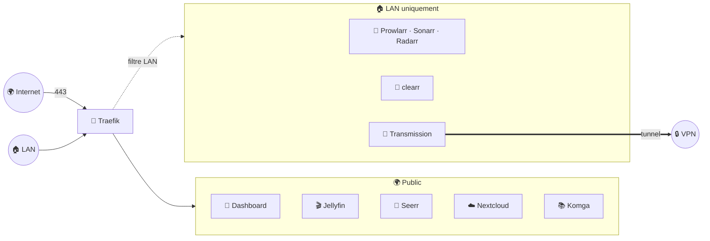

# 🏠 Serveur maison — infra as code

Docker Compose + Traefik pour un petit serveur maison : médias, cloud
personnel, téléchargements derrière VPN, automatisation séries/films, lecture
de BD et sauvegarde. Tout tient sur une seule machine, et le dépôt est pensé
pour pouvoir être repris ailleurs.


```mermaid
flowchart LR
    Internet(("🌍 Internet")) -->|"443"| Traefik["🚦 Traefik"]
    LAN(("🏠 LAN")) --> Traefik

    subgraph public["🌍 Public"]
        direction TB
        Dash["🧭 Dashboard"]
        Jellyfin["🎬 Jellyfin"]
        Seerr["🔎 Seerr"]
        Nextcloud["☁️ Nextcloud"]
        Komga["📚 Komga"]
    end

    subgraph lan["🏠 LAN uniquement"]
        direction TB
        Arr["🤖 Prowlarr · Sonarr · Radarr"]
        Clearr["🧹 clearr"]
        Trans["🧲 Transmission"]
    end

    Traefik --> public
    Traefik -.->|"filtre LAN"| lan
    Trans ==>|"tunnel"| VPN(("🔒 VPN"))
```

## Services

| | Service | Rôle | Adresse | Accès |
|---|---|---|---|---|
| 🧭 | Dashboard | page d'accueil : liens, état, monitoring | `DOMAIN`, `www.DOMAIN` | public |
| 🎬 | [Jellyfin](docs/medias.md) | serveur multimédia | `jellyfin.DOMAIN` | public |
| 🔎 | [Seerr](docs/medias.md#seerr) | recherche et demande de films/séries | `seerr.DOMAIN` | public |
| ☁️ | [Nextcloud](docs/nextcloud.md) | fichiers, agendas, contacts, News | `nextcloud.DOMAIN` | public |
| 📚 | [Komga](docs/komga.md) | lecture BD / comics / mangas | `komga.DOMAIN` | public |
| 🧲 | [Transmission](docs/telechargement.md#vpn--transmission) | client torrent derrière VPN | `transmission.DOMAIN` | LAN |
| 🤖 | [Prowlarr, Sonarr, Radarr](docs/telechargement.md#prowlarr-sonarr-radarr) | indexeurs, suivi et import séries/films | `prowlarr.` `sonarr.` `radarr.DOMAIN` | LAN |
| 🧹 | [clearr](docs/clearr.md) | supprimer torrent + bibliothèque sans re-téléchargement | `clearr.DOMAIN` | LAN |

Sans interface : cross-seed, recyclarr, la sauvegarde restic et les tâches
cron. Le parcours complet d'une demande, de Seerr jusqu'à Kodi, est décrit
dans [Téléchargement](docs/telechargement.md#le-parcours-dun-téléchargement).

## Documentation

| Page | Pour… |
|---|---|
| 🚀 [Installation](docs/installation.md) | installer de zéro : prérequis et 22 étapes |
| 🛠️ [Exploitation](docs/exploitation.md) | commandes `make`, tâches planifiées, journaux, accès WAN temporaire |
| 🏗️ [Architecture](docs/architecture.md) | stacks, réseaux, règles communes (non-root, secrets, `:latest`…) |
| 🚦 [Traefik & dashboard](docs/traefik.md) | exposition, middlewares de sécurité, dashboard |
| 🧲 [Téléchargement](docs/telechargement.md) | VPN, Transmission, Prowlarr/Sonarr/Radarr, hardlinks, cross-seed |
| 🎬 [Médias](docs/medias.md) | Jellyfin, `.nfo`, Seerr, Kodi |
| 🧹 [clearr](docs/clearr.md) | suppression propre |
| 📚 [Komga](docs/komga.md) | BD lues directement depuis les données seedées |
| ☁️ [Nextcloud](docs/nextcloud.md) | services, `occ`, rafraîchisseur de flux |
| 💾 [Sauvegarde](docs/sauvegarde.md) | ce qui est sauvegardé, restauration |
| 🩺 [Dépannage](docs/depannage.md) | du symptôme à la cause, pièges Docker, WSL2 |

Côté poste client : [`kodi/`](kodi/README.md) (addon « Supprimer avec clearr »)
et [`gnome/`](gnome/README.md) (extension GNOME Shell Govee, sans lien avec le
serveur).

## En bref

```sh
cp .env.shared.example .env.shared   # puis le remplir (voir Installation)
make network
make up STACK=traefik                # puis les autres stacks, dans l'ordre
make                                 # liste toutes les commandes
```

> [!NOTE]
> `CLAUDE.md` et `.claude/` servent à un assistant IA qui travaille sur ce
> dépôt : décisions à ne pas remettre en cause, pièges déjà rencontrés.
> La documentation destinée aux humains, c'est `docs/`.
