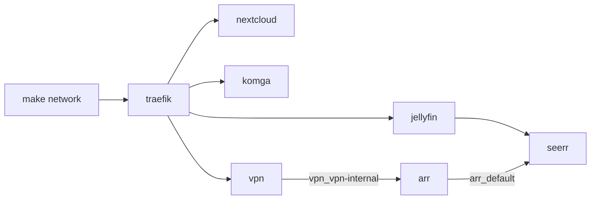
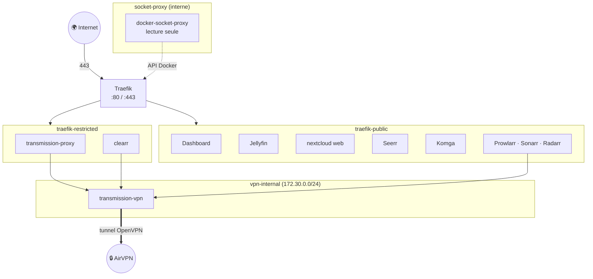

[← Accueil](../README.md) · **Architecture**

# 🏗️ Architecture

Comment les stacks s'articulent, quels réseaux les relient, et les règles qui
valent pour tous les services. Le détail de chaque service est dans sa propre
page (voir l'[accueil](../README.md#documentation)).

> [!NOTE]
> **Principe général** : un seul point d'entrée HTTPS (Traefik, ports 80/443),
> un sous-domaine par service, et aucun conteneur qui parle directement au
> socket Docker.

## Les stacks

Sept stacks Docker Compose, une par dossier, toutes pilotées par le `Makefile`.

| Stack | Services | Exposition |
|---|---|---|
| [`traefik/`](traefik.md) | `socket-proxy`, `traefik`, `dashboard` | point d'entrée ; dashboard public |
| [`jellyfin/`](medias.md) | `jellyfin` | 🌍 public |
| [`nextcloud/`](nextcloud.md) | `db-next`, `app`, `web` | 🌍 public |
| [`seerr/`](medias.md#seerr) | `seerr` | 🌍 public |
| [`komga/`](komga.md) | `komga` | 🌍 public |
| [`vpn/`](telechargement.md) | `transmission-vpn`, `transmission-proxy`, `webproxy` | 🏠 LAN uniquement |
| [`arr/`](telechargement.md) | `prowlarr`, `sonarr`, `radarr`, `cross-seed`, `recyclarr`, [`clearr`](clearr.md) | 🏠 LAN uniquement |

### Ordre de démarrage

Les flèches indiquent « doit tourner avant » : chaque stack rejoint un réseau
créé par la précédente.



## Réseaux



| Réseau | Créé par | Qui y est | Pourquoi |
|---|---|---|---|
| `traefik-public` | `make network` | Traefik + tout service exposé | Traefik y joint les services. Sonarr/Radarr y joignent aussi `jellyfin:8096` en direct. |
| `traefik-restricted` | `make network` | Traefik, `transmission-proxy`, `clearr` | Services **sans authentification** : sur `traefik-public`, un service public compromis pourrait les atteindre sans passer par le filtre LAN. |
| `socket-proxy` | `traefik/` (interne) | `socket-proxy`, `traefik` | Traefik lit les labels via une API Docker restreinte, jamais via `/var/run/docker.sock`. |
| `vpn_vpn-internal` | `vpn/` (subnet figé) | `transmission-vpn` + ses clients (proxy, arr, cross-seed, clearr) | **Seul** réseau de `transmission-vpn`. Un second réseau casserait le routage du tunnel, voir [Téléchargement](telechargement.md#vpn--transmission). |
| `arr_default` | `arr/` | arr, cross-seed, recyclarr, Seerr | Seerr y joint `sonarr:8989`/`radarr:7878` sans passer par Traefik, où ils sont LAN-only. |
| `clearr-arr` | `arr/` | clearr, Prowlarr, Sonarr, Radarr | clearr interroge les API arr. |

> [!WARNING]
> Pour rejoindre le réseau d'une autre stack, déclarer son **vrai nom Docker**,
> préfixé par le dossier du projet : `name: vpn_vpn-internal`. Avec seulement
> `vpn-internal`, la déclaration `external: true` échoue.

## Règles communes à tous les services

| Règle | Comment | Pourquoi |
|---|---|---|
| 🔒 **Non-root dans chaque conteneur** | `cap_drop: ALL` + `no-new-privileges:true` partout ; `user: PUID:PGID` quand l'image le permet | Seuls `db-next` et `transmission-vpn` ont un `cap_add` ciblé (ils démarrent root puis descendent en privilège), justifié en commentaire. Le daemon Docker, lui, reste classique. |
| 🚫 **Jamais de socket Docker monté** | — | Un accès au socket équivaut à root sur l'hôte. C'est ce qui a écarté Nextcloud AIO, et ce qui dicte le transport de clearr et de l'addon Kodi. |
| 🔑 **Secrets hors du dépôt** | `.env` par stack + `.env.shared` à la racine (gitignorés), chacun avec son `.example` versionné | Le dépôt est public. Exception : si l'image recopie ses variables dans sa ligne de commande (visible par `ps`), le secret passe par un fichier monté en lecture seule, plutôt que par une variable d'environnement. |
| 🗂️ **Montages propres à la machine à part** | `docker-compose.override.yml` gitignoré + `.example` | Les compose files de base ne gardent que les montages génériques (`${DATA_ROOT}/.<app>/…`). |
| 🏷️ **Images en `:latest`** | aucun tag figé | Choix assumé : toujours la dernière version, au prix d'une casse possible. La restauration fidèle passe par le manifeste des digests de chaque sauvegarde. **Exceptions** : `recyclarr:8`, qui ne publie plus de `latest` ; `traefik:v3` et `postgres:15-alpine`, dont un changement de majeur casse la config ou la base. Leurs bumps de majeur sont manuels. |
| 🕐 **Fuseau horaire de l'hôte** | bind-mount `/etc/localtime:/etc/localtime:ro` | Ne dépend pas de `tzdata` dans l'image et suit l'heure d'été. Préféré à `TZ=`. |
| 📜 **Logs bornés** | `max-size` **et** `max-file: "3"` | `max-size` seul garde un seul fichier : tout l'historique disparaît à chaque rotation. |
| ❤️ **Healthcheck partout** | HTTP réel si un endpoint non authentifié existe (`/ping` des arr, `/status.php`, `/api/v1/status/appdata`, `/actuator/health`) ; sinon connexion TCP | Visibilité seulement (contour rouge sur le dashboard), **aucune auto-remédiation**. Exception : `recyclarr`, lancé à la demande, n'en a pas. |
| 🌐 **DNS forcé** | `dns: ${DNS_PRIMARY}/${DNS_SECONDARY}` sur `jellyfin`, `arr/*`, `vpn/*` | Le DNS du FAI renvoie `127.0.0.1` pour certains domaines de trackers. |

> [!IMPORTANT]
> **Toujours passer par `make`**, jamais par `docker compose` lancé dans un
> dossier de stack. Compose ne charge que le `.env` du dossier courant :
> `.env.shared` et l'override seraient ignorés.

## Où vivent les données

```
${DATA_ROOT}/
├── .transmission/
│   ├── config/                 settings.json de Transmission
│   └── data/
│       ├── incomplete/
│       ├── completed/          données seedées (sonarr/, radarr/, anime/, bd/…)
│       └── .cross-seed-links/  liens créés par cross-seed
├── library/                    bibliothèque rangée par Sonarr/Radarr (hardlinks)
│   ├── film/
│   ├── series/
│   └── anime/
├── .arr/  .jellyfin/  .seerr/  .komga/  .nextcloud/   config de chaque service
├── .traefik/log/               access log Traefik (seule trace des requêtes WAN)
├── .cron-status/               marqueurs de dernière exécution (dashboard)
├── .clearr.log  .logrotate.conf  .logrotate.state
└── .lan-only-open-until        présent seulement si l'accès WAN temporaire est ouvert
```

`library/` et `.transmission/data/` sont sur **le même disque** et vus par
Sonarr/Radarr à travers **un seul montage** (`${DATA_ROOT}:/data_root`) : c'est
ce qui rend possibles les hardlinks, voir
[Téléchargement](telechargement.md#hardlinks--un-fichier-deux-chemins).

## Arborescence du dépôt

```
server/
├── Makefile              `make` seul = aide générée depuis les cibles
├── .env.shared(.example) PUID/PGID, DOMAIN, DATA_ROOT, LAN_CIDR, DNS_*…
├── docs/                 cette documentation
├── scripts/              provisioning, overrides arr, sauvegarde, dashboard, crontab
├── traefik/ jellyfin/ nextcloud/ vpn/ arr/ seerr/ komga/   une stack par dossier
├── dashboard/            templates + assets du dashboard (html/ est généré)
├── kodi/                 addon Kodi « Supprimer avec clearr » (poste client)
├── gnome/                extension GNOME Shell Govee (poste de travail, hors serveur)
├── sauvegarde/           dépôt restic local (non versionné)
└── CLAUDE.md, .claude/   contexte pour un assistant IA qui travaille sur le dépôt
```

## Voir aussi

- [Dépannage](depannage.md) — les pièges Docker transverses (bind-mounts,
  hardlinks, `cap_drop`…).
- [Exploitation](exploitation.md) — commandes du quotidien.
