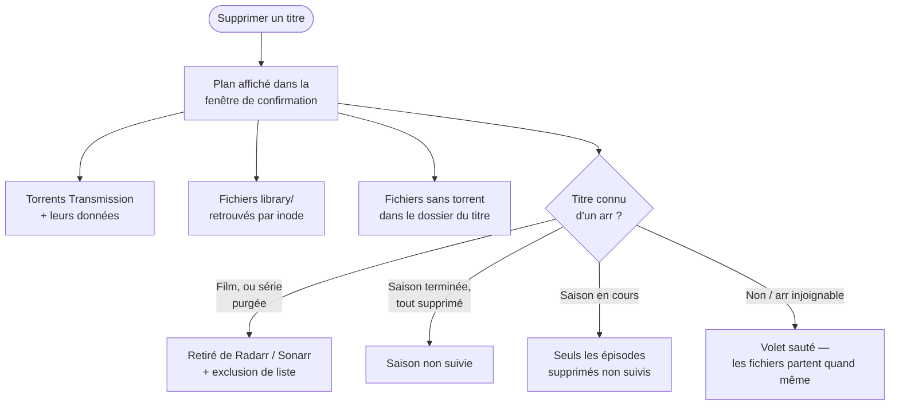

[← Accueil](../README.md) · **clearr**

# 🧹 clearr : supprimer proprement

Sonarr/Radarr et Transmission ne se parlent pas à la suppression. Effacer un
film dans Radarr laisse le torrent seeder, et retirer le torrent laisse le
fichier dans `library/` : le titre, toujours suivi, est re-téléchargé à la
recherche suivante. Aucun outil communautaire (Decluttarr, Removarr…) ne
couvre ce cas. `clearr` (`arr/clearr/`) comble ce trou pour ce déploiement.

## Trois façons de l'utiliser

| Interface | Accès | Quand |
|---|---|---|
| 🌐 **Web** | `https://clearr.<DOMAIN>` (LAN uniquement), démarré avec la stack `arr` | usage courant |
| ⌨️ **TUI** | `make clearr` | en SSH |
| 📺 **Kodi** | menu contextuel « Supprimer avec clearr » (`make kodi-install`) | depuis le canapé, voir [`kodi/README.md`](../kodi/README.md) |

Les trois partagent le même code (`arr/clearr/app/core.py`).

## Ce qu'une suppression fait



- **Le lien torrent ↔ bibliothèque passe par l'inode** : il repose sur les
  hardlinks posés à l'import ([Téléchargement](telechargement.md#hardlinks--un-fichier-deux-chemins)).
- **Pas de re-téléchargement** : le volet arr retire ou désactive le suivi
  de ce qui a été supprimé.
- **Best-effort** : un arr injoignable ou un fichier jamais importé n'empêche
  jamais de supprimer les fichiers.
- **Journal** de chaque suppression dans `${DATA_ROOT}/.clearr.log` (tourné
  chaque semaine). Détail des appels : `CLEARR_LOG_LEVEL=DEBUG` dans
  `arr/docker-compose.yml`.

## Les onglets

| Onglet | Contenu |
|---|---|
| **Torrents** | tous les torrents : âge, taille, ratio, tracker (résolu via Prowlarr). Les cross-seeds sont regroupés sous leur téléchargement d'origine. Marqueurs **BIB** (lié à `library/`) et **ABS** (fichier disparu du disque). |
| **BD** | les torrents sous `completed/bd`, c'est-à-dire la bibliothèque [Komga](komga.md). ⚠️ Supprimer une BD n'en laisse **aucun autre exemplaire**. |
| **Séries** / **Animés** | la liste Sonarr, séparée par le type de série Sonarr (`anime` ou non) |
| **Films** | la liste Radarr |

Dans Séries, Animés et Films, un titre se supprime **en entier** (tous ses
torrents, y compris ceux grabés mais jamais importés, plus les fichiers
restants). Les titres sans fichier sont masqués par défaut, un interrupteur
les affiche.

**Une série se supprime aussi saison par saison**, avec deux boutons :

| Bouton | Effet |
|---|---|
| **Supprimer** | les saisons cochées partent ; la série **reste dans Sonarr** pour que les prochaines saisons arrivent. Redemandée depuis Seerr, une saison supprimée revient. |
| **Purger** | tout part, série retirée de Sonarr avec exclusion de liste. Proposé seulement si toutes les saisons sont cochées. |

**Actions groupées** (onglet Torrents) :

- **Purger les ABS** retire tous les torrents dont le fichier a disparu.
- **Orphelins library/** liste les fichiers de `library/` qu'aucun torrent ne
  couvre et qu'aucun arr ne connaît.

## Sécurité

- **Aucune authentification** : clearr est LAN-only (`arr-lan-only`) et sur
  `traefik-restricted`, jamais joignable depuis un service public.
- **Aucun socket Docker** : il parle à Transmission et aux arr par HTTP.
- **Aucun chemin à supprimer ne vient du navigateur** : tout est recalculé
  côté serveur au moment de la confirmation.
- **Aucun appel WAN** côté serveur.

## Tests

```sh
make test     # chemins destructifs de clearr, stdlib seule, ne touche à rien de réel
```
