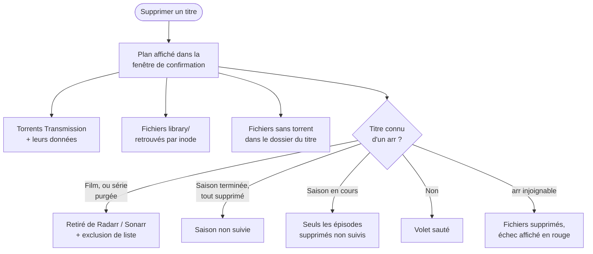

[← Accueil](../README.md) · **clearr**

# 🧹 clearr : supprimer proprement

Sonarr/Radarr et Transmission ne se parlent pas à la suppression. Effacer un
film dans Radarr laisse le torrent seeder, et retirer le torrent laisse le
fichier dans `library/` : le titre, toujours suivi, est re-téléchargé à la
recherche suivante. Aucun outil communautaire (Decluttarr, Removarr…) ne
couvre ce cas. `clearr` (`arr/clearr/`) comble ce trou pour ce déploiement.

## Deux façons de l'utiliser

| Interface | Accès | Quand |
|---|---|---|
| 🌐 **Web** | `https://clearr.<DOMAIN>` (LAN uniquement), démarré avec la stack `arr` | usage courant |
| 📺 **Kodi** | menu contextuel « Supprimer avec clearr » (`make kodi-install`) | depuis le canapé, voir [`kodi/README.md`](../kodi/README.md) |

Les deux partagent le même code (`arr/clearr/app/core.py`). La TUI
(`make clearr`) a été retirée le 2026-10-08.

## Ce qu'une suppression fait



- **Le lien torrent ↔ bibliothèque passe par l'inode** : il repose sur les
  hardlinks posés à l'import ([Téléchargement](telechargement.md#hardlinks--un-fichier-deux-chemins)).
- **Pas de re-téléchargement** : le volet arr retire ou désactive le suivi
  de ce qui a été supprimé.
- **Un arr injoignable n'empêche pas de supprimer les fichiers**, mais ce
  n'est jamais annoncé comme un succès : bandeau rouge (web) ou
  notification d'erreur (Kodi), et l'action manquante apparaît déjà dans la
  fenêtre de confirmation. Il faut alors vérifier le titre dans Sonarr/Radarr.
- **Exception : la suppression saison par saison s'arrête** si Sonarr refuse
  d'arrêter le suivi des saisons. Rien n'est supprimé : effacer une saison
  encore suivie relancerait sa recherche automatique.
- **Journal** de chaque suppression dans `${DATA_ROOT}/.clearr.log` (tourné
  chaque semaine). Détail des appels : `CLEARR_LOG_LEVEL=DEBUG` dans
  `arr/docker-compose.yml`.

## Les onglets

| Onglet | Contenu |
|---|---|
| **Torrents** | tous les torrents : âge, taille, ratio, tracker (résolu via Prowlarr). Triés par défaut du plus récent au plus ancien. Les cross-seeds sont regroupés sous leur téléchargement d'origine. Le nombre de torrents liés à `library/` est dans la ligne de résumé (plus de colonnes BIB ni ABS ; l'onglet BD garde ABS). Première colonne **TYPE**, un picto coloré : fedora = film, OVNI = série, dragon = anime, bulle = BD, **loupe = absent** (ex-ABS : données disparues du disque — un téléchargement en cours, dont les fichiers sont encore sous `incomplete/`, n'est pas absent), ? = inconnu. Source : dossier `bd`, titre Sonarr/Radarr rattaché (anime = série de type anime dans Sonarr), ou catégorie `sonarr`/`radarr`. Rien n'est deviné d'après un nom. Un grab Sonarr/Radarr **terminé sans aucun fichier dans `library/`** est classé d'après la file d'attente de l'arr : **signe interdit** = import bloqué (à débloquer dans l'arr, ou avec la skill `manual-import`), **sablier** = import en cours, **recyclage** = sorti de la file, donc remplacé par une autre release (ou retiré de la file à la main). Arr injoignable : inconnu, rien n'est deviné. Un grab Sonarr en cours de téléchargement est « anime » si la file de Sonarr le rattache à une série de type anime, « série » sinon (ou si Sonarr ne répond pas). Le titre d'une ligne dégradée est coloré : **rouge** = absent ou import bloqué, **orange** = remplacé, **gris** = inconnu. Avant le filtre par nom, des boutons radio filtrent par type (picto, libellé, nombre de torrents ; la description du type s'affiche au survol), en deux groupes : types sains (film, série, anime, BD) puis dégradés (bloqué, en import, remplacé, absent, inconnu). Un type à zéro est grisé ; si le filtre par nom ou une suppression vide le type choisi, « Aucun torrent de ce type » s'affiche. Ce filtre n'est pas mémorisé au rechargement. |
| **BD** | les torrents sous `completed/bd`, c'est-à-dire la bibliothèque [Komga](komga.md). ⚠️ Supprimer une BD n'en laisse **aucun autre exemplaire**. |
| **Séries** / **Animés** | la liste Sonarr, séparée par le type de série Sonarr (`anime` ou non) |
| **Films** | la liste Radarr |

Un onglet **n'apparaît que si son service répond** : BD → Komga, Séries et
Animés → Sonarr, Films → Radarr. Torrents est toujours là. L'état est
revérifié toutes les 30 s au plus : après un `make up` ou un `make down`,
l'onglet peut mettre ce temps à apparaître ou à disparaître.

Dans Séries, Animés et Films, un titre se supprime **en entier** (tous ses
torrents, y compris ceux grabés mais jamais importés, plus les fichiers
restants). Les titres sans fichier sont masqués par défaut, un interrupteur
les affiche.

**Une série se supprime aussi saison par saison**, avec deux boutons :

| Bouton | Effet |
|---|---|
| **Supprimer** | les saisons cochées partent ; la série **reste dans Sonarr** pour que les prochaines saisons arrivent. Redemandée depuis Seerr, une saison supprimée revient. |
| **Purger** | tout part, série retirée de Sonarr avec exclusion de liste. Proposé seulement si toutes les saisons sont cochées. |

**Actions groupées** (onglet Torrents) :

- Plus de purge en masse des absents (retirée du web le 2026-10-07, puis
  avec la TUI le 2026-10-08) : filtre « Absent », puis suppression ligne à
  ligne. Si `completed/` est absent ou vide, ou si **tous** les torrents sont
  absents, un bandeau rouge prévient d'un montage raté : ne rien supprimer.
- **Orphelins library/** liste les fichiers de `library/` qu'aucun torrent ne
  couvre et qu'aucun arr ne connaît. Si la liste a changé entre l'affichage et
  le clic, rien n'est supprimé : il faut rouvrir la fenêtre.

## Sécurité

- **Aucune authentification** : clearr est LAN-only (`arr-lan-only`) et sur
  `traefik-restricted`, jamais joignable depuis un service public.
- **Aucun socket Docker** : il parle à Transmission et aux arr par HTTP.
- **Aucun chemin à supprimer ne vient du navigateur** : tout est recalculé
  côté serveur au moment de la confirmation.
- **Requêtes d'un autre site refusées** (en-têtes `Origin` / `Sec-Fetch-Site`) :
  une page web ouverte depuis le LAN ne peut pas déclencher de suppression.
- **Aucun appel WAN** côté serveur.

## Pièges connus

| Symptôme | Cause | Quoi faire |
|---|---|---|
| Bandeau rouge « action(s) Sonarr/Radarr ont ÉCHOUÉ » après une suppression | l'arr n'a pas répondu : fichiers partis, titre peut-être encore suivi | retirer le titre (ou désactiver la saison) à la main dans Sonarr/Radarr, sinon il revient |
| Un torrent en cours de téléchargement marqué ABS (avant le 2026-09-29) | clearr ne cherchait ses fichiers que sous `completed/` | corrigé : `incomplete/` (et les `.part`) compte aussi |
| **Tous** les torrents en « absent » (loupe) d'un coup, bandeau rouge « problème de montage » | données Transmission non montées (disque absent, montage raté) — ne rien supprimer | vérifier le disque et le montage, puis `make restart STACK=arr` |
| Onglet BD, Séries, Animés ou Films absent | son service (Komga, Sonarr, Radarr) ne répond pas, ou vient de démarrer (cache de 30 s) | `docker ps` ; attendre 30 s et recharger. Pour Komga, la sonde passe par Traefik : Traefik arrêté masque aussi BD |
| Un pack de films emporte d'autres films | un torrent = un seul lot de fichiers | la confirmation (web et Kodi ≥ 1.1.1) liste les autres titres touchés |

## Tests

```sh
make test     # chemins destructifs de clearr, stdlib seule, ne touche à rien de réel
```
