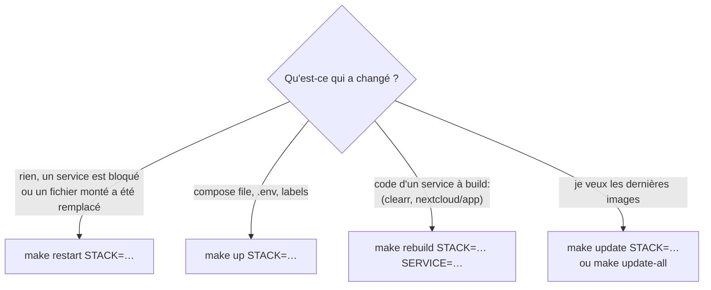
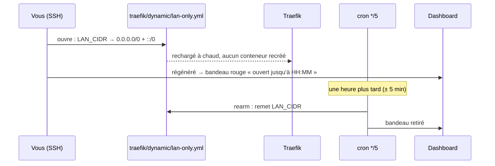

[← Accueil](../README.md) · **Exploitation**

# 🛠️ Exploitation au quotidien

Tout passe par le `Makefile`. `make` seul affiche l'aide, générée depuis les
cibles elles-mêmes, donc toujours à jour.

> [!IMPORTANT]
> Jamais `docker compose` en direct dans un dossier de stack : `.env.shared` et
> l'override ne seraient pas chargés. Toute cible refuse de démarrer si
> `.env.shared` manque ou contient encore les valeurs d'exemple.

## Commandes

`STACK` ∈ `traefik` `jellyfin` `nextcloud` `vpn` `arr` `seerr` `komga`.

| | Commande | Effet |
|---|---|---|
| **Stacks** | `make up STACK=…` | démarre ou recrée la stack |
| | `make down STACK=…` | arrête et supprime ses conteneurs |
| | `make restart STACK=…` | redémarre **sans recréer** (remonte les bind-mounts) |
| | `make restart-all` | `restart` sur toutes les stacks qui ont des conteneurs, Traefik en dernier |
| | `make logs STACK=…` | suit les logs |
| | `make config STACK=…` | compose résolu (pour déboguer un `${VAR}`) |
| **Mises à jour** | `make update STACK=…` | pull + rebuild + recrée (+ maintenance `occ` pour Nextcloud) |
| | `make update-all` | `update` sur chaque stack **démarrée** (les autres sont sautées, un échec n'arrête pas la suite), puis résumé, purge des images et dashboard |
| | `make rebuild STACK=… SERVICE=…` | recrée **un seul** service, sans pull (après une modif de code de `clearr` ou de `nextcloud/app`) |
| **Config arr** | `make recyclarr-sync` | applique les guides TRaSH |
| | `make arr-overrides` | réapplique la config du dépôt par-dessus (toujours **après** `recyclarr-sync`) |
| | `make search-missing ARGS=--dry-run` | recherche des manquants déjà sortis (`--dry-run` : liste sans rien envoyer) |
| | `make mark-finales` | repose les marqueurs de fin de saison dans les `.nfo` |
| **Installation** | `make network` · `make api-keys` · `make provision` · `make cron-install` | voir [Installation](installation.md) |
| **Outils** | `make clearr` | TUI de [clearr](clearr.md) |
| | `make dashboard-refresh` | régénère le [dashboard](traefik.md#le-dashboard) |
| | `make switch-lan-only-middleware` | ouvre ou referme l'accès WAN, voir plus bas |
| | `make test` | tests des chemins destructifs de clearr |
| **Sauvegarde** | `make backup` · `make restore SNAPSHOT=…` | voir [Sauvegarde](sauvegarde.md) |
| **Postes clients** | `make kodi-install` · `make gnome-install` | addon Kodi ([`kodi/`](../kodi/README.md)), extension GNOME Govee ([`gnome/`](../gnome/README.md)) |

### Laquelle choisir ?



> [!TIP]
> Un fichier de config **monté seul** (et non son dossier) reste figé sur
> l'ancien contenu s'il est remplacé plutôt que modifié en place : le
> bind-mount suit l'inode. `make restart` suffit.

## Tâches planifiées

Installées par `make cron-install`. Les tâches liées à une stack ne font rien
si la stack est arrêtée (`scripts/require-running.sh`). Chacune laisse un
marqueur que le dashboard affiche (vert si elle a réussi dans son intervalle).

| Quand | Tâche | Journal |
|---|---|---|
| toutes les 5 min | cron interne Nextcloud (`cron.php`) | — |
| toutes les 5 min | régénération du dashboard | `dashboard/refresh.log` |
| toutes les 5 min | refermeture de l'accès WAN temporaire échu (ne fait rien sinon) | `dashboard/refresh.log` |
| chaque nuit, 0 h | `recyclarr-sync` puis `apply-arr-overrides.py` | `arr/recyclarr-sync.log`, `arr/apply-overrides.log` |
| chaque nuit, 2 h | marqueurs de fin de saison (`mark-finales`) | `arr/mark-finales.log` |
| chaque nuit, 4 h 30 | rotation des journaux (logrotate, sans root) | `dashboard/refresh.log` |
| dimanche, 3 h | sauvegarde restic | `sauvegarde/backup.log` |
| lundi, 5 h | recherche des manquants (`search-missing.py`) | `arr/search-missing.log` |

**Vos propres tâches cron survivent** : `make cron-install` ne remplace que le
bloc délimité par ses deux commentaires marqueurs et recopie le reste tel
quel. Un job perso doit donc vivre **en dehors** de ce bloc. La commande
refuse d'installer si les marqueurs sont déséquilibrés.

> [!WARNING]
> **Dans `scripts/crontab`, tout `%` doit s'écrire `\%`.** cron lit un `%` nu
> comme un saut de ligne : `date +%s` devient silencieusement `date +`. C'est
> impossible à reproduire à la main, et aucune erreur ne s'affiche nulle part.
> De même, ne jamais y écrire de chemin ou d'uid en dur : `__REPO_ROOT__`,
> `__DATA_ROOT__` et `__PUID__` sont substitués à l'installation.

## Journaux

| Journal | Rotation |
|---|---|
| journaux de cron du dépôt (tableau ci-dessus) | via logrotate |
| `${DATA_ROOT}/.clearr.log` | hebdomadaire, 4 conservés |
| `${DATA_ROOT}/.traefik/log/access.log` | quotidienne, 14 conservés |
| `transmission.log` | au-delà de 20 Mo, 4 conservés |
| logs Docker de chaque conteneur | `max-size` + `max-file: 3` |

## Ouvrir temporairement les services LAN-only

Transmission, Prowlarr, Sonarr, Radarr et clearr ne répondent qu'au LAN. Pour
dépanner depuis l'extérieur avec seulement un accès SSH :

```sh
make switch-lan-only-middleware          # ouvre au WAN (refermeture auto après 1 h)
make switch-lan-only-middleware          # referme tout de suite
scripts/lan-only-middleware.sh status    # où on en est
```



- La refermeture est portée par **cron**, pas par un processus en arrière-plan :
  elle survit à la déconnexion SSH et à un redémarrage.
- Ces services **n'ont pas d'authentification forte** : n'ouvrir que le temps
  nécessaire.
