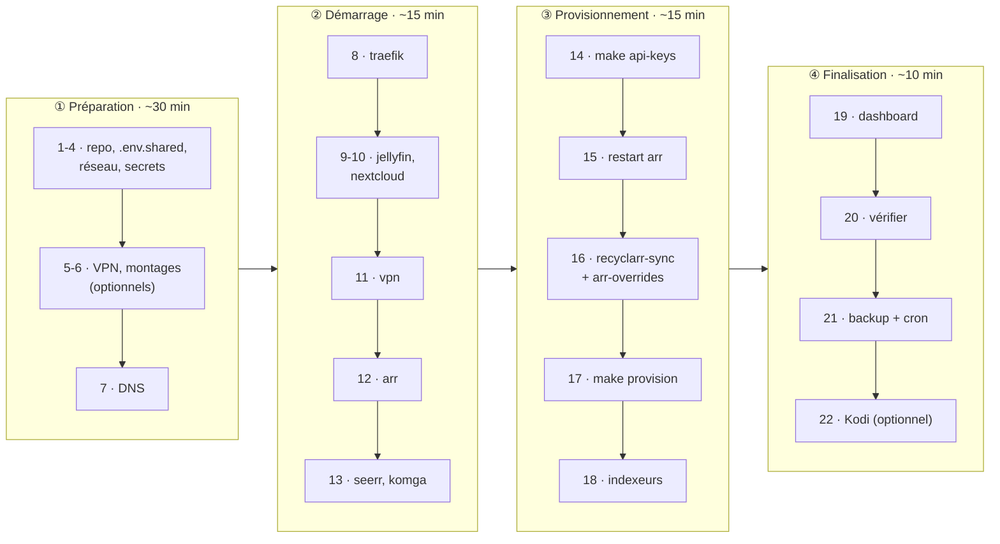

[← Accueil](../README.md) · **Installation**

# 🚀 Installation

Vingt-deux étapes en quatre phases. **L'ordre n'est pas cosmétique** : chaque
phase produit ce dont la suivante a besoin.



> [!CAUTION]
> **Ne jamais copier un `.example` sans remplir ses valeurs.** Un chemin
> d'exemple (`/path/to/…`) dans un override fait créer par Docker toute
> l'arborescence bidon, **en root**, sur l'hôte. Les cibles `make` refusent de
> démarrer tant que `.env.shared` contient les valeurs d'exemple ou que
> `DATA_ROOT` n'existe pas.

## Prérequis

| | Élément | Remarque |
|---|---|---|
| ✅ | Hôte **Linux natif** (bare metal ou VM Linux) | Windows/WSL2 non supporté, voir [Dépannage](depannage.md#windows--wsl2) |
| ✅ | Docker Engine + **Compose v2** (`docker compose`), `make`, `git` | |
| ✅ | Un domaine dont vous gérez le DNS, et les ports 80/443 redirigés vers la machine | Let's Encrypt par challenge HTTP |
| ✅ | `python3` | stdlib seule, aucun paquet pip |
| ✅ | [`restic`](https://restic.net/), `logrotate` | logrotate tourne sans root, avec son propre fichier d'état |
| VPN | module noyau `ip_tables` chargé | absent par défaut sur les Ubuntu récents : `echo ip_tables \| sudo tee /etc/modules-load.d/ip-tables.conf && sudo modprobe ip_tables` |
| VPN | une config OpenVPN (`.ovpn`) | testé avec AirVPN |
| option | GPU exposant `/dev/dri/renderD128` | transcodage Jellyfin ; sinon retirer `devices`/`group_add` de `jellyfin/docker-compose.yml` |
| option | `fail2ban` sur l'hôte | avec une jail sur l'access log Traefik, seule trace des requêtes WAN |
| option | Kodi 19+ avec `jellyfin-kodi` en mode sync | pour l'addon de l'étape 22 |

## ① Préparation

### 1. Cloner

```sh
git clone <url-du-repo> server && cd server
```

### 2. Valeurs partagées

```sh
cp .env.shared.example .env.shared
```

| Variable | Valeur |
|---|---|
| `PUID` / `PGID` | uid/gid du propriétaire des fichiers créés (`id`) |
| `RENDER_GID` | `getent group render` (si GPU) |
| `DOMAIN` | votre domaine |
| `DATA_ROOT` | où vivent les données, idéalement un disque avec de la place |
| `LAN_CIDR` | plage du réseau local : c'est elle qui restreint les services LAN-only |
| `DNS_PRIMARY` / `DNS_SECONDARY` | résolveurs forcés (Cloudflare par défaut) |

### 3. Réseaux Docker partagés

```sh
make network
```

### 4. Secrets de chaque stack

```sh
cp traefik/.env.example    traefik/.env      # ACME_EMAIL
cp nextcloud/.env.example  nextcloud/.env    # POSTGRES_*, NEXTCLOUD_ADMIN_*
cp vpn/.env.example        vpn/.env          # OPENVPN_USERNAME/PASSWORD
cp arr/.env.example        arr/.env          # clés API : remplies aux étapes 14 et 18
```

### 5. Config OpenVPN *(si stack `vpn`)*

Déposer le `.ovpn` du fournisseur dans `vpn/custom/` (voir
[haugene/docker-transmission-openvpn](https://haugene.github.io/docker-transmission-openvpn/),
`OPENVPN_PROVIDER=CUSTOM`).

### 6. Montages personnels *(optionnel)*

```sh
cp jellyfin/docker-compose.override.yml.example  jellyfin/docker-compose.override.yml
cp nextcloud/docker-compose.override.yml.example nextcloud/docker-compose.override.yml
# puis remplacer chaque /path/to/… par un vrai chemin
```

`arr/docker-compose.override.yml` n'est à créer que pour mettre la
bibliothèque ailleurs que `${DATA_ROOT}/library`.

### 7. DNS

Un enregistrement A/AAAA vers l'IP publique pour chaque sous-domaine déployé :

| Toujours | Selon les stacks |
|---|---|
| `DOMAIN`, `www.DOMAIN` (dashboard) | `nextcloud.` · `jellyfin.` · `seerr.` · `komga.` |
| | `transmission.` (vpn) · `prowlarr.` `sonarr.` `radarr.` `clearr.` (arr) |

## ② Démarrage

### 8. Traefik, en premier

```sh
make up STACK=traefik
make logs STACK=traefik     # vérifier l'obtention des certificats
```

### 9. Jellyfin

```sh
make up STACK=jellyfin
cp jellyfin/.env.example jellyfin/.env      # JELLYFIN_ADMIN_USER/PASSWORD
```

Créer le compte admin dans l'assistant (`https://jellyfin.<DOMAIN>`), puis
reporter ses identifiants dans `jellyfin/.env`. Ils ne servent qu'aux deux
opérations que Jellyfin refuse à une clé API : créer la première clé API
(étape 14) et le compte propriétaire de Seerr (étape 17). Les bibliothèques
sont créées à l'étape 17.

### 10. Nextcloud

```sh
make up STACK=nextcloud
```

Le compte admin est créé depuis `nextcloud/.env`. Puis créer le **mot de
passe d'application du rafraîchisseur de flux** :

```sh
cp nextcloud/news-updater/config.ini.example nextcloud/news-updater/config.ini
chmod 600 nextcloud/news-updater/config.ini
docker exec -u "$PUID" nextcloud-app-1 php occ user:auth-tokens:add \
    --name="news-updater" <compte-admin>
```

Reporter le compte et le mot de passe affiché dans `config.ini`, puis
`make up STACK=nextcloud`. Pourquoi un fichier : voir
[Nextcloud](nextcloud.md#le-rafraîchisseur-de-flux-news-updater).

### 11. VPN / Transmission

```sh
make up STACK=vpn
```

Client torrent à pointer sur `https://transmission.<DOMAIN>/transmission/rpc`.

### 12. Arr *(après `vpn`, dont il rejoint le réseau)*

```sh
make up STACK=arr
```

### 13. Seerr et Komga

```sh
make up STACK=seerr     # après jellyfin et arr ; démarre non configuré (étape 17)
make up STACK=komga     # ne dépend que de Traefik
```

> [!WARNING]
> **Réclamer Komga tout de suite** : la première visite de
> `https://komga.<DOMAIN>` crée le compte admin, et le service est public.
> Puis *Settings → Libraries → Add* →
> `/data_root/.transmission/data/completed/bd`.

`make up` crée au préalable les dossiers de config de Seerr et Komga (sinon
Docker les créerait en root et les services crasheraient), ainsi que
`completed/bd`.

## ③ Provisionnement

### 14. Collecter les clés API

```sh
make api-keys
```

Les clés sont générées au premier démarrage, donc impossibles à connaître
avant. La commande lit celles de Prowlarr/Sonarr/Radarr, demande celle de
cross-seed, crée la clé Jellyfin et écrit le tout dans `arr/.env`, sans
écraser une valeur déjà présente.

### 15. Redémarrer arr

```sh
make up STACK=arr       # cross-seed repart avec les vraies clés
```

### 16. Profils qualité

```sh
make recyclarr-sync     # custom formats + profils des guides TRaSH
make arr-overrides      # config du dépôt par-dessus (anime, Jellyfin, .nfo…)
```

**Dans cet ordre** : `arr-overrides` référence par nom des custom formats que
recyclarr vient de créer, et échoue explicitement s'ils manquent.

### 17. Le reste de la configuration

```sh
make provision
```

Crée ce qui se faisait à la main dans les UI :

- bibliothèques Jellyfin **Films / Séries / Animés** ;
- applications Sonarr/Radarr dans Prowlarr, Transmission comme client (et sa
  catégorie `bd`) ;
- root folders `/data_root/library/…` et **remote path mapping** : sans lui,
  les téléchargements ne sont jamais importés, en silence (voir
  [pourquoi](telechargement.md#hardlinks--un-fichier-deux-chemins)) ;
- Connections cross-seed et marqueurs de fin de saison, tags ;
- toute la configuration de Seerr (compte propriétaire, bibliothèques,
  Sonarr/Radarr avec les profils de l'étape 16, premier scan).

**Après l'étape 16**, parce que Seerr désigne les profils par leur nom.
**Additif et relançable** : ne réécrit jamais un objet existant, et un
service arrêté ne fait échouer que ce qui le concerne.

### 18. Indexeurs Prowlarr

```sh
cp arr/profiles/prowlarr-indexers.json.example arr/profiles/prowlarr-indexers.json
# l'adapter, puis :
make provision
```

- Ce fichier est **gitignoré** (il nomme vos trackers) mais sauvegardé. Il ne
  contient **aucun secret** : les `apikey`/`passkey` y sont désignés par nom
  de variable, à renseigner dans `arr/.env`. Un indexeur dont la variable
  manque n'est pas créé, et le script le signale.
- N'y lister que ce qui **diffère du défaut** de la définition Cardigann.
  Pour trouver un `definitionName` :
  ```sh
  docker exec arr-prowlarr-1 curl -s -H "X-Api-Key: <clé>" \
    http://localhost:9696/api/v1/indexer/schema \
    | python3 -c 'import json,sys; [print(i["definitionName"], "—", i["name"]) for i in json.load(sys.stdin)]' \
    | grep -i <tracker>
  ```
- Reporter les ID dans `CROSS_SEED_INDEXER_IDS` (`arr/.env`, l'ID est dans
  l'URL de l'indexeur), puis `make up STACK=arr`.

> [!WARNING]
> Un ID d'indexeur **change si l'indexeur est recréé**, et un ID obsolète ne
> produit aucune erreur, seulement des recherches cross-seed vides.

## ④ Finalisation

### 19. Dashboard

```sh
make dashboard-refresh      # sinon le domaine nu reste vide jusqu'au premier cron
```

### 20. Vérifier

`https://<DOMAIN>`, `nextcloud.`, `jellyfin.`, `seerr.`, `komga.`, et
depuis le LAN `transmission.`, `sonarr.`, `clearr.`… Le dashboard montre d'un
coup d'œil ce qui répond.

### 21. Sauvegardes et tâches planifiées

```sh
make backup          # 1re fois : crée le dépôt et ~/.config/server-restic-password
make cron-install    # installe les 8 tâches du dépôt, sans toucher aux vôtres
```

> [!IMPORTANT]
> Copier **immédiatement** `~/.config/server-restic-password` dans un
> gestionnaire de mots de passe : sans lui, la sauvegarde est illisible.

Détail des tâches : [Exploitation](exploitation.md#tâches-planifiées).

### 22. Addon Kodi *(optionnel, sur la machine qui fait tourner Kodi)*

```sh
make kodi-install     # ou KODI_HOME=/autre/.kodi
```

Redémarrer Kodi. Si l'entrée n'apparaît pas : *Paramètres → Extensions → Mes
extensions → Menus contextuels*. Nécessite le plugin Jellyfin **Kodi Sync
Queue** ; détails dans [`kodi/README.md`](../kodi/README.md).

## Réglages restés manuels

Ces réglages ne sont pas provisionnés. Ils sont conservés par la sauvegarde,
mais à refaire sur une installation neuve :

- plugins Jellyfin, transcodage matériel VAAPI ;
- le port d'écoute Transmission ouvert côté VPN (`settings.json`) ;
- le tag `fr-priority` de Sonarr et son delay profile.
