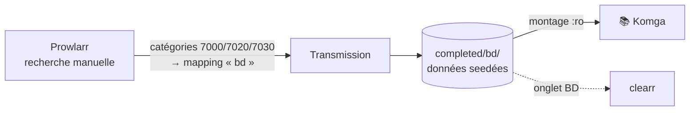

[← Accueil](../README.md) · **Komga**

# 📚 Komga : BD, comics, mangas

Lecteur web de CBZ/CBR/PDF/EPUB sur `komga.<DOMAIN>` (public) : reprise de
lecture, sens de lecture par série, et flux OPDS pour liseuses et tablettes.
Ni Jellyfin ni Kodi ne savent faire ça correctement.

## Le choix structurant : lire les données seedées

Contrairement aux vidéos, **pas d'arr, pas d'import, pas de hardlink, pas de
renommage**. La bibliothèque de Komga *est* le dossier de téléchargement
`${DATA_ROOT}/.transmission/data/completed/bd`.

**Pourquoi** : aucun arr ne sait lire la BD franco-belge (Mylar3 raisonne en
*issues* mensuels à l'américaine, pas en tomes ni en intégrales). Pour une
dizaine de séries par an, l'automatisation n'apporterait rien. **Le but est de
pouvoir lire, pas d'avoir un rayonnage impeccable.**

| Conséquence assumée | Ce que ça veut dire |
|---|---|
| L'arborescence est celle de l'uploadeur | Komga fait une série par dossier. Un pack à plat = une série ; les torrents mono-fichier se regroupent dans une série fourre-tout « bd ». |
| Supprimer le torrent supprime la BD | il n'y a pas de second exemplaire, et garder la BD impose de seeder |
| Aucune métadonnée automatique | titres = noms de dossier ; couvertures générées depuis la 1re page. Les corrections faites dans l'UI sont stockées dans la base Komga, **jamais dans les fichiers**. |

> [!CAUTION]
> **Le montage est en lecture seule, et ce n'est pas négociable.** Ces fichiers
> sont les données seedées : toute écriture invaliderait le hash du torrent.
> Ne jamais utiliser l'outil **Import** de Komga (il déplace des fichiers). Si
> Komf est ajouté un jour, son mode `COMIC_INFO` est interdit : il écrit dans
> chaque archive.

## Ajouter une BD

1. Rechercher dans **Prowlarr** (`prowlarr.<DOMAIN>`) → *Search*.
2. **Avant de grabber, inspecter la liste des fichiers du `.torrent`** (le
   télécharger n'est pas un snatch). Deux releases du même titre peuvent
   donner une série propre… ou 30 fichiers mélangés à plat.
3. Grab : le mapping `bd` l'envoie dans `completed/bd`, Komga le détecte au scan.

## Pièges connus

- **`.cbr` en RAR5 ou en archive « solid » : illisible** (limite de junrar,
  [gotson/komga#52](https://github.com/gotson/komga/issues/52)). La conversion
  en `.cbz` n'est pas possible ici (le montage est `:ro`) : reprendre le titre
  dans une autre release. On peut tester pendant le téléchargement, sur les
  fichiers déjà complets de `incomplete/<torrent>/`.
- **Renommer un dossier crée une nouvelle série** et perd les corrections
  faites dans l'UI (Komga identifie par chemin). Renommer d'abord
  (`torrent-rename-path`, sans casser le seed), éditer ensuite.
- **L'option « One-Shots directory » ne résout pas la série fourre-tout** :
  elle teste si le chemin *contient* la valeur, donc `bd` matcherait tout.
  Pour sortir un fichier nu, `torrent-set-location` vers
  `completed/bd/<nom>/`.
- **Ne jamais ajouter un second client Transmission dans Prowlarr pour la
  BD** : Prowlarr alterne entre clients de même priorité sans regarder les
  catégories, et une grab sur deux partirait dans `completed/bd`. C'est le
  *mapping* de catégorie qui route.
- **La base Komga est le seul inventaire des BD** (aucun arr ne peut
  reconstituer la liste) : elle est dans la sauvegarde, ne pas l'en retirer.

## Installation et sécurité

- Pas de `.env` : **la première visite de `komga.<DOMAIN>` crée le compte
  admin**. À faire immédiatement après `make up STACK=komga`, le service étant
  public.
- `make up` crée le dossier de config **et** `completed/bd` (monté en `:ro`,
  Docker ne pourrait pas le créer).
- Déclarer la bibliothèque dans l'UI : *Settings → Libraries → Add* →
  `/data_root/.transmission/data/completed/bd`. Le chemin est le même des deux
  côtés du montage, pour correspondre à celui de clearr.
- Exposé au WAN après audit de sa configuration (2026-09-22) : API, OPDS et
  SSE exigent une authentification, `/actuator/health` ne rend que `UP`.
  Komga **ne verrouille aucun compte** après des échecs : le `rate-limit` de
  Traefik est le seul frein à la force brute.
- JVM plafonnée à 1 Go (`-Xmx1g`) ; à relever en cas d'`OutOfMemoryError` sur
  un très gros `.cbz`.
