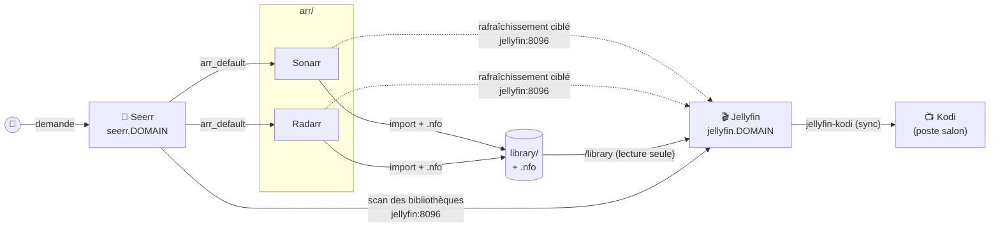

[← Accueil](../README.md) · **Médias**

# 🎬 Médias : Jellyfin, Seerr et Kodi

Ce qui se passe une fois un fichier importé dans `library/` : comment il
devient visible, bien identifié, et demandable par quelqu'un qui n'ouvrira
jamais Sonarr.



## Jellyfin

Serveur multimédia, public sur `jellyfin.<DOMAIN>` (avec `rate-limit`).

| Élément | Comment |
|---|---|
| Bibliothèques **Films / Séries / Animés** | créées par `make provision` sur `/library/{film,series,anime}` (montage `:ro` de `${DATA_ROOT}/library`) |
| Bibliothèques personnelles (musique, photos, téléchargements bruts…) | `jellyfin/docker-compose.override.yml`, propre à la machine |
| Transcodage matériel | `/dev/dri/renderD128` + groupe `render` ; **VAAPI s'active à la main** (Tableau de bord → Lecture) |
| Plugins | à installer à la main ; `Kodi Sync Queue` est requis pour que Kodi voie les suppressions |
| Compte admin | assistant de 1re connexion, puis identifiants recopiés dans `jellyfin/.env` (voir [installation](installation.md#9-jellyfin)) |

### Des titres bien identifiés : les `.nfo`

La connexion arr → Jellyfin ne transmet **qu'un dossier à rescanner**, aucun
identifiant. Sans aide, Jellyfin devine chaque titre par une recherche TMDB
sur « nom du dossier + année », et se trompe sur les homonymes (*Dead Man*
pris pour *Dead Man Walking*, *One Piece* pour la série live-action).

Sonarr et Radarr écrivent donc un `.nfo` à côté de chaque fichier (metadata
writer « Kodi (XBMC) / Emby », sans images). Il porte les identifiants
IMDb/TMDB/TVDB, et Jellyfin le lit **en premier** : l'identification devient
déterministe.

| Conséquence | Détail |
|---|---|
| ✅ Films en français | `movieMetadataLanguage: French` côté Radarr |
| ⚠️ Séries en anglais / VO | Sonarr n'a aucun réglage de langue des métadonnées. **Écart accepté.** |
| ✅ Suppression depuis Kodi fiable | l'addon clearr envoie les identifiants vus par Jellyfin ; un ID faux rendait le titre insupprimable |
| ✅ Tag `pour-les-enfants` | posé depuis Seerr, il ressort dans le `.nfo`, puis dans Jellyfin, puis dans Kodi, où il sert de filtre (un seul compte, filtrage par tags) |

**Renommage à l'import** : activé sur les deux arr, parce que Jellyfin déduit
la saison du `SxxExx` du **nom de fichier**, qui prime sur le dossier
`Season NN` (un `S01E1172` d'anime atterrissait en saison 1). Le réglage ne
vaut que pour les imports à venir : **ne pas lancer de renommage
rétroactif**. Jellyfin identifie les épisodes par leur chemin, et on perdrait
les « vu » et les positions de reprise.

### Délai d'apparition

```
import par Sonarr/Radarr                 0 s
  → Jellyfin rafraîchit le dossier       +60 s   (LibraryMonitorDelay)
  → Kodi Sync Queue enregistre           +5 s
  → jellyfin-kodi met Kodi à jour        +25 s
```

Les déclencheurs arr → Jellyfin (import, upgrade, renommage, **suppression**)
garantissent que le bon dossier est signalé. Ils **ne raccourcissent pas** les
60 s, qui s'appliquent aussi aux notifications. Ce délai n'a pas été réduit
volontairement : il évite de scanner un fichier encore en cours d'écriture.

## Seerr

Interface de recherche et de demande pour les non-techniciens : une affiche,
un bouton « Demander », et Seerr pilote Sonarr/Radarr en coulisses. Public
sur `seerr.<DOMAIN>`, avec sa propre authentification (comptes Jellyfin).
C'est le successeur de Jellyseerr/Overseerr, fusionnés et dépréciés.

- **« Disponible » vient des bibliothèques Jellyfin**, pas de Sonarr/Radarr.
  Sans bibliothèque Jellyfin sur `library/`, tout paraît absent et Seerr
  propose de redemander l'existant.
- Seerr joint **`sonarr:8989`/`radarr:7878`** par le réseau `arr_default` et
  **`jellyfin:8096`** en direct. Il ne passe jamais par le domaine public :
  le `rate-limit` de Traefik lui renvoyait des `429` pendant sa synchro
  nocturne, et un 429 y est indiscernable d'un titre supprimé.
- `externalHostname` porte l'URL publique de Jellyfin (sans `/` final). Sans
  elle, les liens « Lire sur Jellyfin » deviendraient `http://jellyfin:8096/…`.
- Tout est configuré par `make provision` : compte propriétaire, bibliothèques,
  Sonarr/Radarr avec leurs profils, scan initial.

### Pièges connus

- **Répertoire de config créé en root = crash `EACCES` en boucle** : l'image
  tourne en UID 1000 et ne corrige pas les droits de son volume. `make up`
  crée `${DATA_ROOT}/.seerr/config` au préalable ; en cas de doute,
  `sudo chown -R "$PUID:$PGID" ${DATA_ROOT}/.seerr`.
- **`settings.json` s'édite conteneur arrêté** (`docker stop`/`start`) : Seerr
  le réécrit lui-même, une édition à chaud est perdue.

## Kodi

Kodi (poste salon) réplique la bibliothèque **Jellyfin**, pas le disque, via
l'addon `jellyfin-kodi` en mode synchro et **chemins directs**. Le dépôt
fournit un addon de menu contextuel, **« Supprimer avec clearr »**, qui
supprime un film, une série ou une saison entière depuis Kodi (torrents,
fichiers et entrée arr).

```sh
make kodi-install      # sur la machine où tourne Kodi, puis redémarrer Kodi
```

Fonctionnement, limites et délais mesurés : [`kodi/README.md`](../kodi/README.md).

## Pièges connus (Jellyfin)

- **Jellyfin 12 n'accepte par défaut que l'en-tête
  `Authorization: MediaBrowser Token="…"`.** Les connexions Sonarr/Radarr
  envoient `X-Emby-Token` et tombaient en `401` en silence (Jellyfin retombait
  sur son watcher). Rétabli par `EnableLegacyAuthorization=true`, posé via
  l'API (`/System/Configuration`). C'est un sursis : le jour où Jellyfin
  retirera ce réglage, il faudra un correctif côté Servarr.
- **`notification/testall` des arr ne prouve rien** pour Jellyfin : il répond
  `isValid: true` même quand le vrai rafraîchissement est en 401.
- **`system.xml` se modifie par l'API**, pas à la main : Jellyfin réécrit ce
  fichier.
- **`jellyfin.db` corrompue** : ne pas supprimer le fichier (Jellyfin se croit
  en mise à niveau et plante en boucle). Tenter
  `sqlite3 <copie>.db ".recover"`, réimport dans une base neuve,
  `PRAGMA integrity_check`. En dernier recours seulement, repartir de zéro
  avec `IsStartupWizardCompleted=false`.
- **`data/SQLiteBackups/` vide est normal** : copie temporaire avant une
  migration, effacée si elle réussit. La seule sauvegarde de `jellyfin.db` est
  le snapshot restic hebdomadaire.
