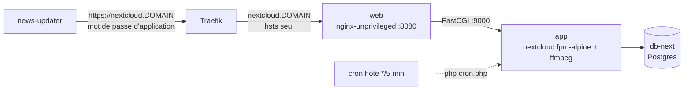

[← Accueil](../README.md) · **Nextcloud**

# ☁️ Nextcloud

Cloud personnel (fichiers, agendas, contacts, News) sur `nextcloud.<DOMAIN>`,
public. On utilise l'**image communautaire** et non Nextcloud AIO : AIO pilote
ses propres conteneurs via le socket Docker et se configure dans sa propre UI,
ce qui est incompatible avec un fonctionnement non-root et une infra décrite
par du code.



| Service | Détail |
|---|---|
| `db-next` | Postgres, données sous `${DATA_ROOT}/.nextcloud/db-next`. Un des deux seuls services avec `cap_add` (démarre root puis descend). |
| `app` | build local (`nextcloud/app/Dockerfile`) : image FPM + `ffmpeg` pour les aperçus vidéo. Webroot sous `${DATA_ROOT}/.nextcloud/nexcloud`. |
| `web` | nginx non-root avec le `nginx.conf` officiel ; porte les en-têtes de sécurité |
| `news-updater` | rafraîchit les flux de l'app News pour **tous** les utilisateurs |

## Au quotidien

```sh
docker exec -u "$PUID" nextcloud-app-1 php occ <commande>   # occ
make update STACK=nextcloud     # pull + rebuild + maintenance occ (voir ci-dessous)
```

`make update STACK=nextcloud` enchaîne après la recréation :
`app:update --all`, `db:add-missing-columns/indices/primary-keys` et
`maintenance:mimetype:update-*`. Le cron interne (`cron.php`) est lancé par
le crontab de l'hôte toutes les 5 minutes.

**Stockages externes** (dossiers de l'hôte à exposer dans Nextcloud) :
`nextcloud/docker-compose.override.yml`.

## Le rafraîchisseur de flux (`news-updater`)

Il s'authentifie en admin, via un **mot de passe d'application** dédié (et
révocable seul) lu dans `nextcloud/news-updater/config.ini` (`chmod 600`). Deux
choix délibérés :

- **un fichier plutôt qu'une variable d'environnement** : l'entrypoint de
  l'image recopie ses variables dans `--password`, lisible par tout
  utilisateur local via `ps` ;
- **`user: PUID:PGID`** plutôt que root. Avec `cap_drop: ALL`, root perd
  `CAP_DAC_OVERRIDE` et ne peut plus lire un fichier `600` qui ne lui
  appartient pas.

Tant que `config.ini` est vide, seul ce conteneur redémarre en boucle, le
reste de Nextcloud fonctionne.

## Pièges connus

- **Pas de `security-headers` Traefik sur Nextcloud.** Son contrôle de
  sécurité exige `X-Robots-Tag: noindex,nofollow` et `X-Frame-Options:
  sameorigin` à l'identique, et le middleware partagé les écrasait. Les
  en-têtes viennent de `nextcloud/web/nginx.conf`. Attention au piège nginx :
  un `add_header` dans une `location` annule tous ceux du bloc `server`, d'où
  leur répétition dans les `location` des assets.
- **Changer de domaine** : `occ config:system:set trusted_domains …` et
  `overwrite.cli.url`, jamais en éditant `config.php` à la main.
- **Une mise à jour majeure peut désactiver une app** dont `max-version` est
  dépassée (vécu avec News en passant à NC 35). Vérifier
  `occ app:list` après chaque saut de version majeure.
- **`admin_audit` est désactivée** : elle suit le `loglevel` global (à 2) et
  jetait donc ses événements. Ne la réactiver qu'avec un `log.condition`
  dédié.
- **Secret « introuvable » alors que le montage est bon** : c'est en général
  le `cap_drop` qui empêche de le lire (voir plus haut). Ne jamais élargir les
  permissions du secret.
