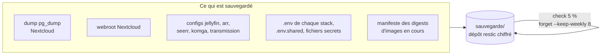
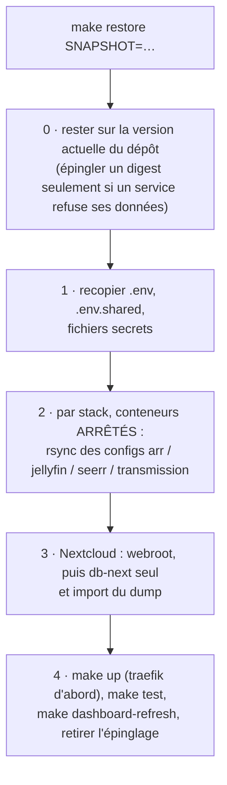

[← Accueil](../README.md) · **Sauvegarde**

# 💾 Sauvegarde et restauration

Une politique volontairement simple : **restic**, chaque dimanche à 3 h,
incrémental et dédupliqué, **8 snapshots hebdomadaires** (~2 mois), dans
`sauvegarde/` sur un **autre disque** que `DATA_ROOT`.



## Ce qui est dedans, et ce qui n'y est pas

| ✅ Sauvegardé | ❌ Exclu volontairement |
|---|---|
| Base Nextcloud (`pg_dump --create` cohérent, pas une copie des fichiers Postgres) **et ses rôles** (`pg_dumpall --roles-only`) | `library/` et `.transmission/data/` : médias re-téléchargeables, trop volumineux |
| Webroot Nextcloud, dont le code (l'entrypoint en a besoin pour arbitrer install/upgrade) et `custom_apps/` | Aperçus Nextcloud (`appdata_*/preview`) |
| Configs Jellyfin (sans `metadata/`), Prowlarr/Sonarr/Radarr (dont leurs `Backups/`, seule copie cohérente de leur base), cross-seed, Seerr, Komga, Transmission | Cache Jellyfin, `metadata/` Jellyfin, `MediaCover` et logs des arr |
| Tous les `.env` (collectés par boucle sur les stacks, un nouveau est couvert d'office), `.env.shared` | `nextcloud.log`, `audit.log`, `transmission.log` |
| `arr/profiles/prowlarr-indexers.json`, les `docker-compose.override.yml`, `vpn/custom/` (config OpenVPN) | |
| **Manifeste des digests d'images** : les tags étant `:latest`, c'est lui qui dit quelle version tournait | |

**Critère de tri** : ce qui change chaque semaine coûte à chaque snapshot, le
reste est dédupliqué et ne coûte qu'une fois.

> [!IMPORTANT]
> **Le mot de passe du dépôt est dans `~/.config/server-restic-password`**,
> généré au premier `make backup`. Sans une copie ailleurs (gestionnaire de
> mots de passe), le dépôt est illisible.

> [!WARNING]
> **Résilience** : la perte du disque `DATA_ROOT` se restaure depuis
> `sauvegarde/`. La perte du disque de `sauvegarde/` emporte la sauvegarde ;
> seule l'infra reste récupérable depuis GitHub. **Pas de copie hors site
> pour l'instant**, c'est accepté.

## Commandes

```sh
make backup                        # à la demande (le cron le fait le dimanche)
make restore SNAPSHOT=latest       # ou un id de snapshot
```

Le **dump SQL est supprimé du disque** après envoi : il contient les hachages
de mots de passe et les jetons Nextcloud. Si Nextcloud est arrêté, le dump est
sauté et le reste de la sauvegarde se fait quand même.

## Restaurer

`make restore` **n'écrit jamais sur les données en service**. Il restaure dans
un dossier à part, puis **affiche** les étapes, à faire à la main :



### Sur une machine neuve

Testé de bout en bout le 2026-09-29 sur une VM vierge : les 20 comptages
vérifiés (séries, épisodes, films, indexeurs, éléments Jellyfin, fichiers,
agendas et partages Nextcloud, demandes Seerr, BD Komga) sont identiques à la
prod.

```sh
git clone <url-du-repo> ~/server && cd ~/server   # même chemin qu'avant si possible
cp -a <disque de sauvegarde>/restic-repo sauvegarde/
install -m 600 <mot de passe du gestionnaire> ~/.config/server-restic-password
make restore SNAPSHOT=latest    # pas besoin de .env.shared : il est dans la sauvegarde
```

`make restore` retrouve dans le snapshot le `DATA_ROOT` et le chemin du dépôt
d'origine, et affiche les commandes avec les bons chemins, y compris s'ils ont
changé (il le signale alors).

> [!TIP]
> **Pas de retour à l'infra de la sauvegarde** : la version actuelle du dépôt
> relit les données des précédentes, et revenir en arrière réintroduirait des
> bugs corrigés depuis. Le commit de la sauvegarde n'est affiché que pour
> information (il n'existe plus pour les snapshots d'avant le 2026-08-09,
> l'historique ayant été réécrit). Les tags `backup-*` ont été supprimés le
> 2026-09-29.

## Pièges connus

- **Un chemin de restauration jamais exercé cache des bugs.** Le premier
  vrai test de `make restore` a révélé que chaque sauvegarde antérieure
  contenait le dump de la **mauvaise base** (`postgres` au lieu de
  `nextcloud`, 26 lignes au lieu de 279 tables) : un `${POSTGRES_DB:-…}` sur
  une variable jamais définie. Tester une restauration de temps en temps.
- **`restic forget` doit grouper par hôte** (`--group-by host`). Par défaut,
  il groupe aussi par liste de chemins : chaque changement de cette liste crée
  un groupe qui n'est plus jamais élagué (~10 Gio épinglés), et la rétention
  réelle retombe à un seul snapshot.
- **Restaurer à chaud** écraserait des bases SQLite ouvertes (arr, Jellyfin) :
  toujours `make down STACK=…` avant le `rsync`.
- **Pièges trouvés en restaurant sur une machine vierge** (corrigés dans
  `restore.sh`) : `make restore` exigeait un `.env.shared` qui n'existe que
  dans la sauvegarde ; `rsync` ne crée pas les dossiers parents (d'où les
  `mkdir -p`) ; l'import Postgres partait avant la fin de l'initialisation du
  cluster (d'où l'attente) ; un cluster neuf naît avec une base `nextcloud`
  vide, à supprimer avant l'import.
- **La stack `vpn` d'une machine de test ne doit pas démarrer** : elle
  ouvrirait une seconde session AirVPN avec les mêmes identifiants.
- Un fichier secret ajouté à la stack doit l'être aussi à `scripts/backup.sh`,
  qui ne collecte automatiquement que les `.env`.
