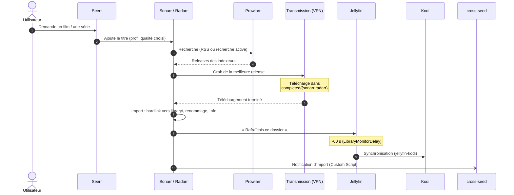
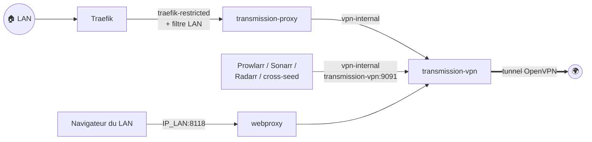
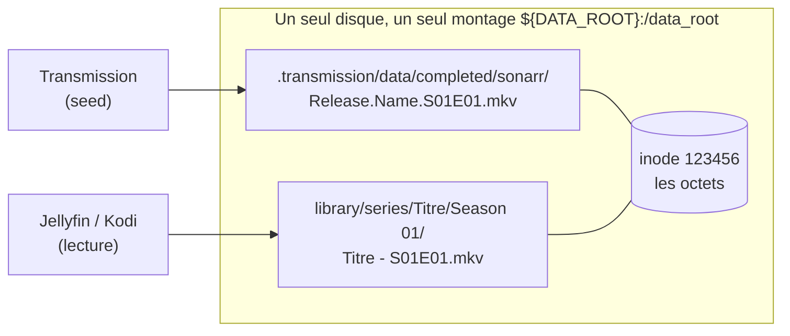

[← Accueil](../README.md) · **Téléchargement**

# 🧲 Téléchargement : VPN, Transmission et arr

La chaîne qui transforme une demande (« je veux ce film ») en fichier rangé
dans la bibliothèque, sans jamais sortir hors du tunnel VPN.

| Service | Stack | Rôle |
|---|---|---|
| `transmission-vpn` | `vpn/` | client torrent ; tout son trafic passe par OpenVPN (AirVPN) |
| `transmission-proxy` | `vpn/` | nginx, seul pont entre Traefik et le RPC de Transmission |
| `webproxy` | `vpn/` | relais TCP vers le Privoxy intégré (navigateur du LAN → IP du tunnel) |
| Prowlarr | `arr/` | gère les indexeurs (trackers) et les partage aux autres |
| Sonarr / Radarr | `arr/` | suivent séries / films, grabent, importent dans `library/` |
| cross-seed | `arr/` | re-partage un fichier déjà téléchargé sur d'autres trackers |
| clearr | `arr/` | suppression propre torrent + bibliothèque → [page dédiée](clearr.md) |

Toutes les interfaces sont **LAN uniquement** (`transmission.`, `prowlarr.`,
`sonarr.`, `radarr.`, `clearr.<DOMAIN>`).

## Le parcours d'un téléchargement

## VPN / Transmission

- Le client torrent se configure sur
  `https://transmission.<DOMAIN>/transmission/rpc`. Aucun port n'est publié sur
  l'hôte.
- Les arr joignent `transmission-vpn:9091` **directement** par
  `vpn-internal`. `transmission-proxy` ne sert qu'à l'accès humain.
- **`webproxy`** expose le Privoxy de l'image pour qu'un navigateur du LAN
  sorte par l'IP du tunnel (contourner un blocage géographique).
- **10 téléchargements simultanés** (`TRANSMISSION_DOWNLOAD_QUEUE_SIZE`, défaut
  5). Un magnet qui ne trouve pas ses métadonnées garde sa place sans rien
  télécharger : à 5, trois magnets bloqués suffisaient à geler toute la file.

> [!CAUTION]
> Privoxy **n'a aucune authentification**. Le port est lié à l'IP LAN de
> l'hôte (défaut `127.0.0.1`), jamais `0.0.0.0` : un port publié par Docker
> contourne le pare-feu. Ne jamais le rediriger sur la box. Côté navigateur,
> désactiver WebRTC (il révèle l'IP réelle) et n'y connecter aucun compte
> personnel : l'IP de sortie est celle qui seede.

### Pièges connus

- **Ne jamais attacher `transmission-vpn` à un second réseau Docker.** L'image
  pousse une route `redirect-gateway def1`, qui couvre aussi `172.16.0.0/12`,
  la plage des réseaux Docker. Un second réseau casse tout le routage sortant
  (`rtnl: generic error (-101)`, plus de DNS ni de ping), de façon
  reproductible. D'où le sidecar `transmission-proxy`.
- **Même piège avec `LOCAL_NETWORK`** : n'y mettez jamais le sous-réseau du
  conteneur (chaque entrée fait un `ip route replace`). Pour laisser un pair
  du même réseau joindre le RPC, utiliser `UFW_ALLOW_GW_NET=true`.
- **Module `ip_tables` requis sur l'hôte** (absent par défaut sur les Ubuntu
  récents, passés à nftables) : `/etc/modules-load.d/ip-tables.conf` contenant
  `ip_tables`. Sans lui, le kill-switch ne se met pas en place.
- **`transmission-remote -w <dir>` avant `-a` change le dossier par défaut de
  la session**, pas celui du torrent ajouté. Toujours écrire
  `-a <magnet> -w <dir>`. Sonarr/Radarr collant leur catégorie au dossier par
  défaut courant, l'erreur se propage à tous les grabs suivants.
- **`settings.json` n'est réécrit qu'à l'arrêt du daemon** : lire l'état réel
  par `session-get`, jamais dans le fichier ; une édition à chaud est perdue.
- **Déplacer des données** : `torrent-set-location … move=true`, jamais `mv`.
  Sur le même disque, l'inode est conservé (les hardlinks survivent), mais pas
  les symlinks de cross-seed.

## Prowlarr, Sonarr, Radarr

Images `lscr.io/linuxserver/*`. Elles démarrent normalement en root pour
appliquer `PUID`/`PGID` ; ici elles tournent dans le mode non-root documenté
par LinuxServer (`user: PUID:PGID` + `tmpfs /run`, sans `cap_add`). On perd
seulement les Docker Mods, qui ne sont pas utilisés.

### Hardlinks : un fichier, deux chemins

Un fichier téléchargé est **à la fois** seedé par Transmission et rangé dans la
bibliothèque, sans occuper deux fois la place :

Trois conditions, toutes posées par `make provision` :

1. **Un seul montage** `${DATA_ROOT}:/data_root` pour Sonarr et Radarr. Deux
   bind-mounts séparés, même d'un seul et même disque, font échouer `link()`
   en `Cross-device link`, et l'import retombe **silencieusement** en copie
   (~185 Go récupérés en corrigeant).
2. **Remote path mapping** : Transmission annonce `/data/completed/…`, les arr
   voient `/data_root/.transmission/data/completed/…`. Sans lui les
   téléchargements aboutissent mais ne sont **jamais importés**, sans erreur.
3. Root folders sur `/data_root/library/{film,series,anime}`.

Si `library/` est sur un autre disque que le reste de `DATA_ROOT`
(vérifiable avec `df`), les imports deviennent des copies : ça marche, en plus
lent et en plus gros.

### Règles de sélection

Ce que les profils Sonarr/Radarr doivent obtenir, pour les films, les séries
et les anime (règles fixées le 2026-10-07, appliquées le jour même).

| Critère | Règle |
|---|---|
| **Regrab** | Le **minimum** : un seul téléchargement par épisode ou film. Moins de bande passante, moins de ratio consommé, moins de pollution. |
| **Langue** | Œuvre d'origine française : **VOF obligatoire**. Sinon **VOSTFR minimum**, VF ou MULTi (avec le français) **préféré**. |
| **Profil enfants** | **VF obligatoire** (VOF ou VF), quelle que soit l'origine. |
| **Résolution** | **2160p** préféré, sinon **1080p**, sinon **720p** en dernier recours. **Anime : 1080p maximum.** |
| **Codec** | **x264 minimum** ; plus le codec est récent, plus il est préféré : AV1 > x265 > x264. |
| **Colorimétrie** | **HDR** préféré. |
| **Débit** | Bornes min/max par résolution (voir plus bas). |
| **Délai et cutoff** | **24 h** d'attente avant de grabber, puis **plus jamais de remplacement** : on attend la bonne release au lieu de remplacer la première venue. |

Une œuvre française n'a pas de profil à part : ses releases ne sont jamais
titrées VOSTFR, la règle « VOSTFR minimum » donne d'elle-même la VOF.

> [!NOTE]
> La langue se juge sur une **annonce explicite** du titre (`VOSTFR`,
> `SUBFRENCH`, `FRENCH`, `VFF`, `MULTi`…). Vérifié sur 589 fichiers : 0 %
> sans français quand un tracker français l'annonce, mais **12 % sans
> français pour un `MULTi` de Nyaa** (pistes multiples d'une plateforme).
> Ces 12 % viennent tous d'un seul groupe, **VARYG** (9 MULTi sur 13 sans
> français). D'où des profils anime qui ne comptent un `MULTi` comme de la VF
> que pour une **liste blanche de groupes vérifiés** : Tsundere-Raws,
> Manostro, BYOR, ToonsHub, KAF, TenmaLand, SUPPLY, BATGirl, FW, GL0P
> (181 fichiers MULTi en bibliothèque, tous avec l'audio français, au
> 2026-10-07). Un groupe n'y entre qu'après lecture de ses fichiers : le skill
> Claude `multi-groupes` propose les ajouts et retraits.

#### Comment les profils les appliquent

Six profils, déclarés dans `arr/profiles/` et appliqués chaque nuit par
`make arr-overrides`. Chacun traduit les règles ci-dessus pour un public :

| Arr | Profil | But | Langue exigée | Langue préférée | Résolutions |
|---|---|---|---|---|---|
| Sonarr | `Séries` | séries, défaut | VOSTFR | VF ou MULTi | 2160p > 1080p > 720p |
| Sonarr | `Séries VF` | séries pour enfants | VF ou MULTi | — | 2160p > 1080p > 720p |
| Sonarr | `Anime` | anime, défaut | VOSTFR | VF explicite, ou MULTi d'un groupe vérifié | 1080p > 720p |
| Sonarr | `Anime VF` | anime pour enfants | VF explicite, ou MULTi d'un groupe vérifié | — | 1080p > 720p |
| Radarr | `Films` | films, défaut | VOSTFR | VF ou MULTi | 2160p > 1080p > 720p |
| Radarr | `Films VF` | films pour enfants | VF ou MULTi | — | 2160p > 1080p > 720p |

Dans tous les profils, à langue égale : la meilleure résolution, puis le
meilleur codec (AV1 > x265 > x264), puis le HDR. Une release sous la langue
exigée, ou qui coche un rejet, n'est jamais grabée.

Toutes les résolutions d'un profil sont dans **un seul groupe de qualités** :
Sonarr/Radarr classent par qualité *avant* le score, et sans ce groupe une
VOSTFR 2160p battrait toujours une MULTi 1080p. Dans le groupe, c'est le
score des custom formats (`arr/profiles/custom-formats.json`) qui décide,
avec des ordres de grandeur qui fixent les priorités :

| Ordre | Custom format | Score |
|---|---|---|
| 1. langue | VF : `Langue : VF` (séries, films ; `MULTi` compris), ou en anime `Langue : VF (hors MULTi)` + `Langue : MULTi (groupe vérifié)` | 3000 |
| | `Langue : VOSTFR` | 2000 |
| | *minimum du profil* | 2000, ou 3000 pour un profil `… VF` |
| 2. résolution | `Résolution : 2160p` / `1080p` | 300 / 200 |
| 3. codec | `Codec : AV1` / `x265` / `x264` | 30 / 20 / 10 |
| 4. HDR | `HDR` | 5 |
| rejet | `Rejet : codec ancien`, `3D`, `bonus`, `upscale` (+ `pack NN of NN`, `sous-titres non FR` en anime) | -10000 |

**Jamais d'upgrade** (`upgradeAllowed: false`) : le premier grab est
définitif. Pour qu'il soit le bon, un **délai unique de 24 h** (profil de
délai par défaut, aucun profil de délai à tag) laisse arriver les meilleures
releases avant de choisir. Mesuré le 2026-10-07 : la release minimale sort en
moins de 24 h dans 90 % des cas (anime) à 100 % (séries, films), et la
meilleure est déjà là à 24 h pour 65 % des anime et 73 % des séries.

**Quand le délai s'applique.** Les 24 h se comptent depuis la **publication
de la release sur l'indexeur**, pas depuis le moment où l'arr la voit.

1. Release de moins de 24 h : rejetée et mise **en attente** dans la file
   (statut `delay`).
2. Les releases trouvées ensuite pour le même épisode ou film rejoignent les
   candidates.
3. Dès que la plus ancienne en attente dépasse 24 h, l'arr prend **la
   meilleure** des candidates, même toute récente. Le grab part au RSS sync
   suivant (Sonarr toutes les 15 min, Radarr toutes les 30 min).

| Situation | Délai |
|---|---|
| Nouvel épisode ou film tout juste sorti, vu au RSS | **appliqué** (le cas visé) |
| Titre déjà sorti ajouté par Seerr ou à la main | appliqué, mais ses releases ont déjà plus de 24 h : grab immédiat |
| Recherche lancée depuis l'interface | **ignoré** |
| Commande envoyée par l'API, dont `search-missing.py` | **ignoré** a priori : l'API marque la commande `trigger: manual`, ce que le code Servarr traite comme une recherche lancée par l'utilisateur |

> [!WARNING]
> Une recherche lancée à la main ou par l'API grabbe sans attendre, et ce
> grab est définitif. Pour un épisode sorti il y a moins de 24 h, mieux vaut
> laisser le RSS faire.

**Tailles** (Mo/min, globales à chaque arr : elles valent pour tous ses
profils) :

| Résolution | Min | Max | Pourquoi |
|---|---|---|---|
| 720p | 5 | 40 | |
| 1080p | 7 | 80 | 7 laisse passer les AV1/x265 bien compressés (anime ~8-16) ; 80 garde les WEB-DL non réencodés (~55-60) et coupe les remux |
| 2160p | 20 | 100 (films BluRay : 120) | plafond tenu pour le disque : un WEB 2160p non réencodé dépasse souvent 100 |

**Profils enfants** : le tag `pour-les-enfants`, posé depuis Seerr à la
requête, fait basculer la série ou le film sur la variante `VF` de son profil
(`Séries` → `Séries VF`, `Anime` → `Anime VF`, `Films` → `Films VF`). Sens
unique : retirer le tag ne repasse pas en VOSTFR.

> [!WARNING]
> La bascule par tag se fait **la nuit suivante**. Une requête Seerr d'un
> contenu déjà sorti part tout de suite, avec le profil par défaut. Pour un
> enfant, choisir directement le profil `… VF` dans les options de la
> requête Seerr.

### Ce que le dépôt configure

| Réglage | Porté par | Effet |
|---|---|---|
| Profils, custom formats, tailles, délai | `arr/profiles/` + `apply-arr-overrides.py` | les règles ci-dessus, réappliquées chaque nuit |
| Ratio 1.5 sur les indexeurs publics | `PUBLIC_INDEXER_SEED_RATIO` | un tracker public ne compte pas le ratio ; les privés ne sont pas touchés |
| Repacks | `downloadPropersAndRepacks: doNotPrefer` | un REPACK ne passe pas devant le score (et sans upgrade, ne remplace jamais un fichier) |
| Rejet des archives/exécutables | `failDownloads` | une « release » `.exe`/`.zipx` est marquée en échec et remplacée automatiquement |
| Recherche des manquants | `search-missing.py`, lundi 5 h | Sonarr/Radarr **ne re-cherchent jamais** seuls un manquant raté au RSS ; plafonné à 12 recherches, rotation par ancienneté ; tâche en rouge si l'arr fait échouer la commande de recherche |
| Marqueurs de fin de saison | `mark-finale.sh`, hook + cron 2 h | `†` fin de saison, `‡` fin de série, `½` mi-saison devant le titre d'épisode (visible dans Kodi) |

Pas de recyclarr (retiré le 2026-10-07) : sur nos trackers français, les
custom formats des guides TRaSH ne changeaient le choix que dans 3 % des cas,
**toujours en pire** (une VOSTFR préférée à une MULTi), et leurs rejets
écartaient de bonnes releases françaises. Détail dans
`.claude/docs/arr-config.md`.

**Déclaratif ou additif ?** `apply-arr-overrides.py` **fait autorité** : une
modification faite à la main dans l'UI sur son périmètre est annulée la nuit
suivante. `provision.py` fait l'inverse : il **crée ce qui manque et ne
réécrit jamais**, donc ce qu'il a créé (client de téléchargement, root
folders, tags…) peut être ajusté librement dans les UI.

### Pièges connus

- **Un titre « manquant » est souvent déjà téléchargé**, bloqué dans la file
  (`importBlocked`/`importPending`) : aucune erreur visible hors de la file.
  Le dashboard compte ces téléchargements (un pack compte pour un, même si
  Sonarr crée une entrée de file par épisode) ; `scripts/manual-import.py`
  (skill `manual-import`) les débloque.
- **Un REPACK grabé puis refusé à l'import** (« Not a Custom Format upgrade »),
  sur un fichier déjà en place en mieux : symptôme du défaut
  `preferAndUpgrade`, qui fait passer le repack avant le score. Réglé à
  `doNotPrefer` par `make arr-overrides` (2026-10-01). L'entrée restée en file
  se purge via le skill `manual-import`.
- **Fichiers posés en vrac** à la racine d'un dossier scanné : ignorés sans
  log. Utiliser *Manual Import*.
- **Un import manuel par l'API sans `downloadId` déplace le fichier** au lieu
  de le hardlinker : le torrent perd ses données et passe ABS dans clearr.
  Hors file d'attente, passer `"importMode": "hardlink"`. Pour réparer :
  `ln` du fichier de `library/` vers son ancien chemin sous `completed/`, puis
  vérifier le torrent dans Transmission.
- **Écritures asynchrones** : certaines écritures de config Servarr répondent
  `202 Accepted` et s'appliquent plus tard (observé de 0,5 s à 53 s). Un
  « lire → comparer » juste derrière voit encore l'ancienne valeur.
  `apply-arr-overrides.py` relit donc jusqu'à stabilisation (`settle()`) :
  il faut **60 s sans rien à corriger**, relu toutes les 10 s. Un
  `make arr-overrides` dure donc au moins 2 minutes (Sonarr puis Radarr).
- **Rapport de `make arr-overrides` en cas d'erreur** : les lignes
  `corrigé:` listent tout ce qui a été écrit, même si l'étape a échoué
  ensuite ; un indexeur en échec n'empêche pas de traiter les suivants. Exit 1
  dès qu'une ligne `erreur:` apparaît.
- **`make provision` / `make api-keys` : `ignoré:` ≠ `erreur:`**. `ignoré:`
  (exit 0) = prérequis pas encore en place (clé absente, conteneur arrêté,
  fichier à copier) : relancer une fois corrigé. `erreur:` (exit 1) = service
  injoignable ou réponse HTTP en erreur. Un élément ignoré n'empêche plus de
  traiter les autres (indexeurs, serveurs Seerr).
- **Un fichier déjà en place n'est jamais remplacé**, même s'il ne respecte
  pas les règles (importé avant le 2026-10-07, ou à la main) : sans upgrade,
  rien ne le rattrape. Le remplacer à la main (supprimer le fichier puis
  lancer une recherche, ou grab manuel dans l'UI).
- **Boucle de regrab** (avant le 2026-10-07) : un custom format qui matche le
  titre du post mais pas le nom du fichier (`MULTI` dans le titre, `FRENCH`
  dans le fichier) fait scorer la release plus haut que le fichier importé ;
  la même release a l'air d'un upgrade d'elle-même (12 grabs de *Coyote vs.
  Acme* le 29/09). Impossible sans upgrade ; à garder en tête si on les
  réactive.
- **Les arr demandent un login, même depuis le LAN** (`authenticationRequired:
  enabled`, posé par `make arr-overrides`). Avec `disabledForLocalAddresses`,
  toute IP Docker comptait comme locale : jellyfin, seerr ou nextcloud-web,
  exposés au WAN, lisaient la clé API sur `/initialize.json`. Les appels par
  clé API (Seerr, cross-seed, clearr, scripts) ne sont pas concernés.
  Réglage relu au démarrage seulement : redémarrer l'arr après un changement.
- **`trustedNetworks` = le réseau Docker du proxy**, pas le LAN : il désigne
  les proxies dont on croit le `X-Forwarded-For` (l'IP réelle du client dans
  les journaux).

## cross-seed

Re-partage sur d'autres trackers un fichier déjà téléchargé (même contenu,
autre `.torrent`), ce qui améliore le ratio sans télécharger une deuxième
fois. Déclenché à chaque import par un **Custom Script** Sonarr/Radarr
(`arr/scripts/cross-seed-notify.sh`), plus une recherche périodique.

- Le montage reste `/data` (cross-seed n'a pas de remote path mapping) ; ses
  liens vont dans `/data/.cross-seed-links`, **sous le même montage**.
- La recherche périodique ne couvre que les torrents de moins de 30 jours
  (cadence 3 j / exclusion 9 j / 30 j, contraintes de validation de
  cross-seed). Un rattrapage complet se lance à la main, jamais en automatique.

### Pièges connus

- **Custom Script, pas Webhook** : le Webhook générique envoie un test sans
  vrai hash, cross-seed le rejette et **la connexion ne s'enregistre pas**.
- **Scripts montés en dossier** : `arr/scripts/` est vu en
  `/custom-scripts` (lecture seule) par Sonarr et Radarr. Un script modifié
  par `git pull` est pris en compte **tout de suite**, sans restart. Avant le
  2026-09-29, chaque script était monté seul sous `/config/custom-*.sh`, et
  le conteneur gardait l'ancienne version. `make provision` repointe une
  connexion restée sur l'ancien chemin.
- **`useClientTorrents: true`** requis dans `arr/cross-seed/config.js`, sinon
  chaque notification échoue (`Torrent client does not have any torrent…`).
- **Les ID d'indexeur Prowlarr changent** quand un indexeur est recréé. Un ID
  obsolète dans `CROSS_SEED_INDEXER_IDS` ne produit **aucune erreur**,
  seulement `Found 0 torrents` à chaque fois. Après toute recréation
  d'indexeur, mettre à jour `arr/.env` puis `make up STACK=arr`.

## Voir aussi

- [Médias](medias.md) — ce qui se passe après l'import (Jellyfin, `.nfo`,
  Kodi, Seerr).
- [clearr](clearr.md) — supprimer un titre sans qu'il revienne.
- [Komga](komga.md) — les BD passent par Prowlarr mais **sans** arr.
