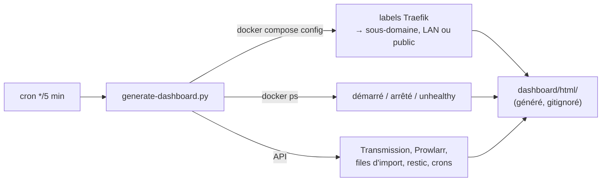

[← Accueil](../README.md) · **Traefik & dashboard**

# 🚦 Traefik, exposition et dashboard

Traefik est le **seul** service qui écoute sur l'hôte (80/443). Il obtient les
certificats Let's Encrypt, route chaque sous-domaine vers son conteneur et
applique les middlewares de sécurité. La stack `traefik/` porte trois
conteneurs :

| Conteneur | Rôle |
|---|---|
| `socket-proxy` | API Docker restreinte, lecture seule, sur un réseau interne : Traefik ne voit jamais `/var/run/docker.sock` |
| `traefik` | reverse proxy + TLS (challenge HTTP). Écoute 8080/8443 dans le conteneur (non-root), mappés sur 80/443 |
| `dashboard` | serveur HTTP minimal de la page d'accueil (Traefik ne sait pas servir de fichiers statiques) |

## Qui est exposé, et comment

| Routeur | Hôte | 🏠 LAN only | `rate-limit` | `security-headers` | `hsts` |
|---|---|:-:|:-:|:-:|:-:|
| dashboard | `DOMAIN`, `www.DOMAIN` | | | ✅ | ✅ |
| jellyfin | `jellyfin.` | | ✅ | ✅ | ✅ |
| seerr | `seerr.` | | ✅ | ✅ | ✅ |
| komga | `komga.` | | ✅ | ✅ | ✅ |
| nextcloud | `nextcloud.` | | | ❌ *(voir plus bas)* | ✅ |
| transmission | `transmission.` | ✅ `transmission-lan-only@file` | | ✅ | ✅ |
| prowlarr / sonarr / radarr / clearr | `<nom>.` | ✅ `arr-lan-only@file` | | ✅ | ✅ |

| Middleware | Défini où | Contenu |
|---|---|---|
| `hsts` | labels du conteneur `traefik` | `max-age` 180 jours, `includeSubDomains` posé **sur chaque service** : un favori vers `jellyfin.` qui ne charge jamais le domaine nu est protégé quand même |
| `security-headers` | labels du conteneur `traefik` | `X-Robots-Tag: noindex, nofollow, noarchive` (ni moteurs ni crawlers IA), `X-Frame-Options: DENY`, `nosniff`, `Referrer-Policy: no-referrer` |
| `rate-limit` | labels du conteneur `traefik` | 50 req/s en moyenne, rafale 100, par IP. Seul rempart anti-force-brute de Komga, qui ne verrouille aucun compte |
| `arr-lan-only`, `transmission-lan-only` | `traefik/dynamic/lan-only.yml` (provider `file`) | `ipAllowList` sur `LAN_CIDR` |

Les middlewares partagés sont définis **une seule fois** et référencés par
`<nom>@docker`. Ne jamais recopier `stsSeconds` ou des en-têtes en dur dans
un compose file.

> [!NOTE]
> **Nextcloud n'a que `hsts`.** Son contrôle de sécurité compare les en-têtes
> en égalité stricte (`noindex,nofollow`, `sameorigin`), et ceux de
> `security-headers` le faisaient échouer. Ses en-têtes viennent du
> `nginx.conf` officiel, voir [Nextcloud](nextcloud.md).

### Ouvrir temporairement au WAN

Les filtres LAN sont dans un **fichier rechargé à chaud**, pas dans des labels,
pour pouvoir les ouvrir sans recréer aucun conteneur (dépannage à distance
avec seulement un accès SSH). Mode d'emploi :
[Exploitation](exploitation.md#ouvrir-temporairement-les-services-lan-only).

## Le dashboard

Page d'accueil sur le domaine nu et `www.`, publique : les sous-domaines
qu'elle liste sont de toute façon publics via les journaux Certificate
Transparency.

**Ce qu'il affiche**

- **Trois groupes de services** : Public, Local (LAN), Stack non lancée.
  Déduits de l'état réel, rien à maintenir à la main hormis le nom affiché et
  le logo (`scripts/generate-dashboard.py`, `dashboard/assets/logos/`).
- **Contour rouge** autour d'un service `unhealthy`.
- **Cartes LAN grisées pour un visiteur WAN** : chaque carte sonde une image
  du service avec `` (un `fetch` échouerait pareil qu'il soit bloqué ou
  non, à cause de CORS). Le chemin sondé est dans `PROBE_PATH` et doit
  renvoyer une vraie image.
- **Bandeau rouge** tant que l'accès WAN temporaire est ouvert.
- **Invisible des moteurs et des crawlers**, par trois voies redondantes :
  `<meta name="robots">`, `dashboard/assets/robots.txt` et l'en-tête
  `X-Robots-Tag`.
- **Section Monitoring** (dépliable) : ratios et débits Transmission par
  tracker, torrents en erreur ou absents, **imports bloqués / en attente**
  (comptés par téléchargement, un pack compte pour un),
  santé de chaque indexeur Prowlarr, âge de la dernière sauvegarde,
  **tâches planifiées** (vert si la tâche a réussi dans son intervalle).

> [!TIP]
> Une carte grisée alors que le conteneur est `healthy` ne vient pas forcément
> du chemin sondé. Les arr redirigent tout vers `/login` (login exigé depuis
> le LAN), d'où leur sonde sur `/Content/Images/Icons/favicon-32x32.png`,
> servi sans authentification. Diagnostiquer d'abord avec
> `curl -o /dev/null -w '%{http_code} %{content_type}' <url data-probe>`.

## Pièges connus

- **Traefik ne retente pas seul un certificat en échec** (par ex. DNS en
  NXDOMAIN au moment de la tentative) : redémarrer le conteneur une fois le
  DNS corrigé.
- **Sans `traefik/dynamic/lan-only.yml`, les 5 routeurs LAN répondent 404**
  (défaillance en mode fermé). `make up` le recrée
  (`lan-only-middleware.sh ensure`).
- **Bruit normal au redémarrage** : une quinzaine de
  `middleware "hsts@docker" does not exist` pendant ~5 s, le temps que Traefik
  lise ses propres labels.
- **Changer le domaine de Nextcloud** ne se limite pas au label : il faut
  aussi `trusted_domains`/`overwrite.cli.url` via `occ config:system:set`.
- **Page surlignée « périmée »** : la régénération échoue. Elle refuse
  volontairement de publier une page fausse quand `docker ps` ou
  `docker compose config` échoue (sinon une stack entière disparaîtrait de la
  page). Lire `dashboard/refresh.log`, relancer `make dashboard-refresh`.
- **Access log** (`${DATA_ROOT}/.traefik/log/`) : seule trace des requêtes WAN,
  403 des filtres LAN compris. Un `fail2ban` sur l'hôte qui lit ce fichier est
  recommandé (hors stack).
